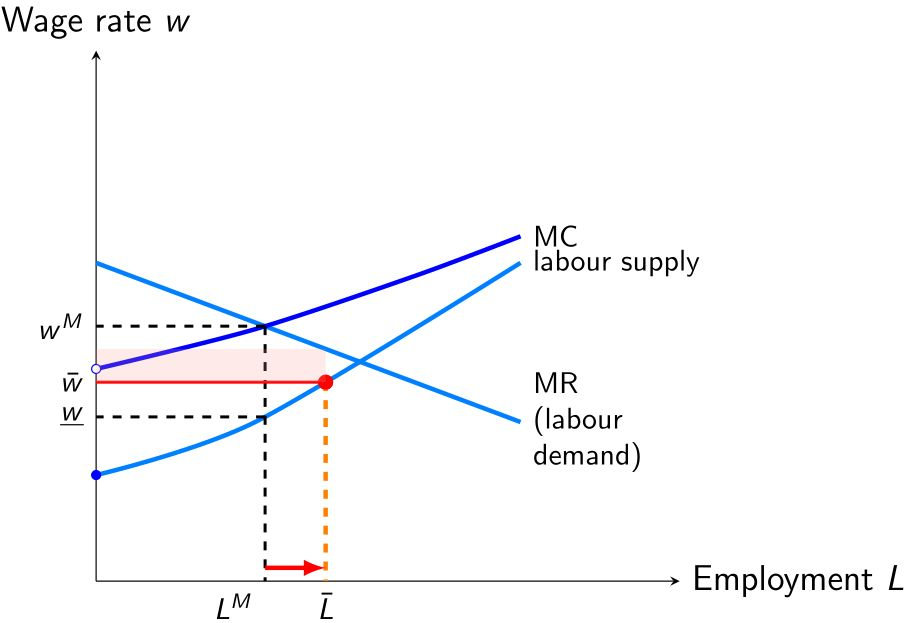

```{css CSS setting, echo=FALSE, results = "hide"}
.SeiroBenign {
  background-color: #FFEBCD;
  padding: 0.5em; /*文字まわり（上下左右）の余白*/
  /* border: 1px solid yellow; */
  /* font-weight: bold; */
}
.SeiroLightWreen {
  background-color: #D0F0C0; /* Tea green */
  padding: 0.5em; /*文字まわり（上下左右）の余白*/
  font-family: Noto S	ans;
  /* border: 1px solid yellow; */
  /* font-weight: bold; */
}
/* Define a margin before hX (header level X) element */
h1  {
  margin-top: 3ex;
  margin-bottom: 3ex;
  /* background: #c2edff; */ /*背景色*/
  padding: 0.5em;/*文字まわり（上下左右）の余白*/
}
h2  {
  margin-top: 2ex;
  margin-bottom: 2ex;
  padding: 0.5em;/*文字周りの余白*/
  ####color: #010101;/*文字色*/
  color: #87a5f2;
  /* background: #eaf3ff; */ /*背景色*/
  /* border-bottom: solid 3px #516ab6; */ /*下線*/
}
DBlue {
  color: dodgerblue;
}
Blue {
  color: blue;
}
Red {
  color: red;
}
```

<style type="text/css">
  body, td{
  font-size: 16pt;
}
</style>


# Introduction

# Agricultural minimum wages in South Africa

# Previous work

Since the late 1990's, there has been a long debate on the employment impacts of minimum wages. The traditional view under a competitive labour market expected that the employment will be reduced with an increased level of minimum wages. The expectation did not match the empirical results, however. Summaries of evidence suggest that the employment impacts are relatively small, if they exist [@Manning2021; @DubeLindner2024]. 

It has always been argued that labour markets may not be competitive [@Robinson1933; @Manning2013; @Manning2021ILRreview]. An early work discussed multiple channels that firms can adjust with, and firms can choose not to adjust on labour [@MaCurdy2015]. Even after narrowing the channel to labour market transactions, oligopsonistic firms still have a few options: laying off workers, labour-labour substituion^[Upgrading the skill contents of labour while keeping the level of employment. ] [@Horton2025], or reducing the firm's labour market transaction margins (wage markdowns). However, relatively few studies examine the adjustment channels beyond lay offs. This study aims to examine the plausibility of shrinking labour market margins. @Azaretal2023 are the first to examin this channel and use online labour market data of store clerks for the US wide representativeness. They find that HHI softens the possible unemployment impacts of minimum wages. 

# Monopsony and unemployent impacts

We test if the labour market concentration, a proxy for labour market power, reduces the unemployment impacts of minimum wages. Under a standard theory, oligopsonistic firms can mitigate unemployment impacts of minimum wages through two channels: Increased labour supply and reduced wage markdowns [@BhaskarManningTo2002] (see @sec-monopsonist). 

The minimum wage for a monopsonist effectively transforms an upward sloping labour supply curve to a horizontal line. When the minimum wage is set lower than the competitive wage at the competitive employment level, it can result in an increased level of employment. In reality, marginal revenue curves differ across firms and there is an additional pressure on firms through competition between firms on the labour demand side, which dilute the positive employment response. Firms with low marginal revenue curves may exit the market. The end result is thus either negative or positive, while the scale of the impact may be muted from the pure competitive case or the pure monopsonist case. 

## Monopsonist responses to a minimum wage {#sec-monopsonist .appendix}

{#fig-Fig1 .column-margin width=80%}

Let us consider the monoposonist case for simplicity in @fig-Fig1. Prior to minimum wage imposition, profit-maximising employment is chosen at $L^{M}$ while the competitive employment is given at the level where $MR$ and labour supply curve intersect. Monopsonist employment is smaller than competitive employment. The wage markdown is given by $\frac{w^{M}}{\underline{w}}>1$. 

When the minimum wage is imposed at $\bar{w}$, the labour supply curve changes to the horizontal line at $\bar{w}$ for employment levels less than $\bar{L}$, because it is above the original labour supply curve. This means that the monopsonist will face an increased labour supply schedule. This leads to an increased employment which is accompanied by the reduced wage markdown from $\frac{w^{M}}{\underline{w}}$ to $\frac{MR(\bar{L})}{\bar{w}}$. 

# Data

## Sampling frame

# Estimation strategy


We estimate:
\begin{equation}
y_{jrt} = a_{0}+a_{1t}FA_{jr0}+a_{2t}H_{jr0}+a_{3t}FA_{jr0}H_{jr0}+c_{j}+c_{t}+e_{jrt}
\label{esteqn}
\end{equation}
For worker $i$, firm $j$ in region $r$ in period $t$, $y_{jrt}$ is an outcome variable, $FA_{jr0}$ is a fraction of affected workers among all workers or a treatment exposure rate at period zero, $H_{jr0}$ is Harfindahl-Hirschman Index of employment in region $r$ at period zero, $c_{j}$ and $c_{t}$ are two-way fixed effects in firms and periods, and $e_{jrt}$ is an idiosyncratic error. $a_{1t}$ captures the classical wage increase impacts which we expect to be negative, and $a_{3t}$ gives the estimate of interest, the unemployment reduction impacts of labour market concentration. We follow @HarasztosiLindner2019 in transforming the LHS of \eqref{esteqn} in percentages, so $a_{1}$ becomes an elasticity of the minimum wage and $a_{3}$ is the change in the elasticity.

The underlying identification assumption behind \eqref{esteqn} is the common trend at all levels of $y_{jrt}$. Our justification is that we assume the economy is in the steady state, so the all level variables grow at the same rate for all firms. Empirically, it suffices to have the firm's outcome growth to follow some probability distribution with the common mean. We allow the estimated coefficients to be time variant. This gives an event-study like interpretation of the estimated impacts. Given the dynamic adjustment process of firms, this flexibility will give us more nuanced interpretation of impacts.

## Impacts of minimum wages

# Results

## Main results

## Robustness checks

# Conclusion

