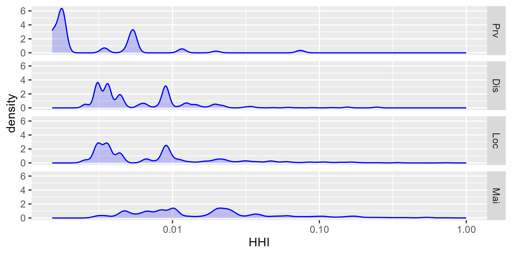
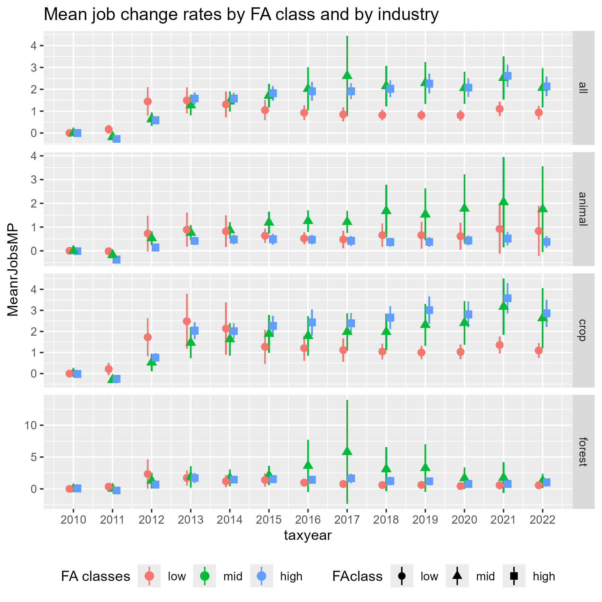
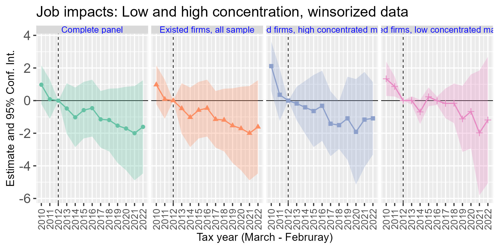
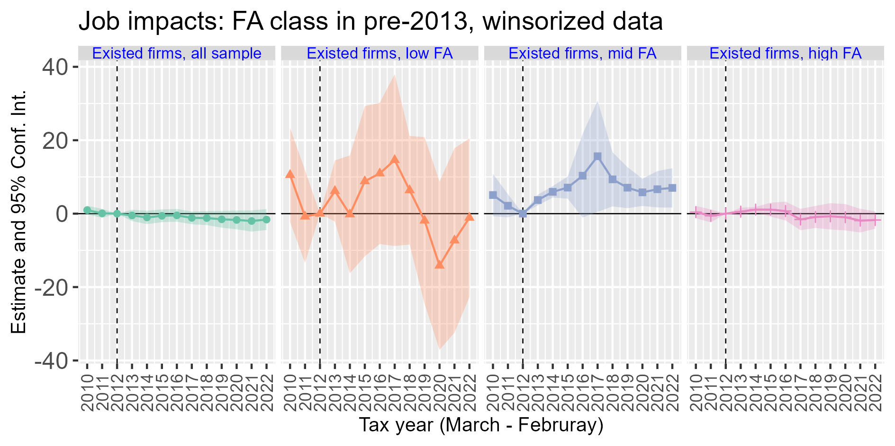
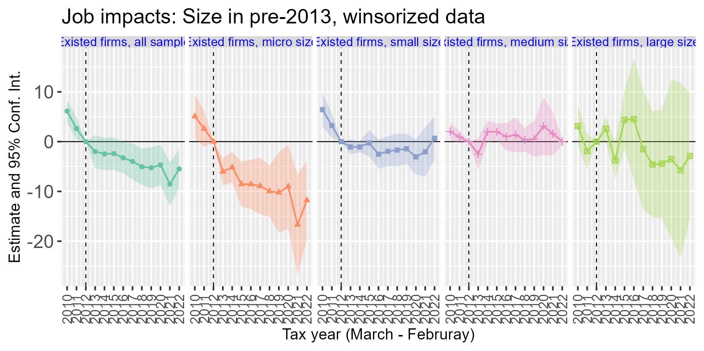
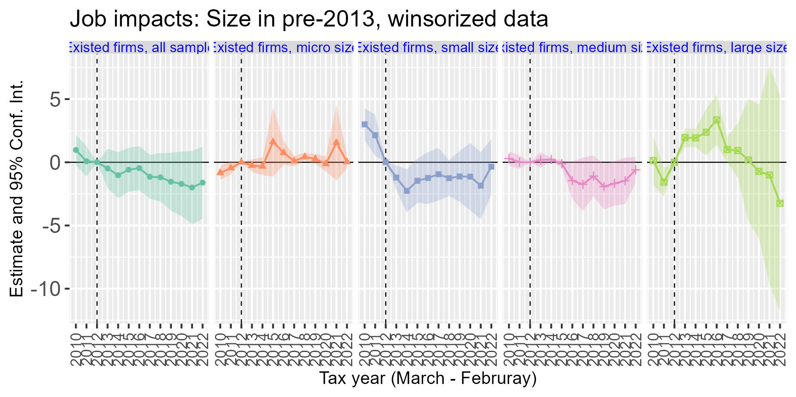
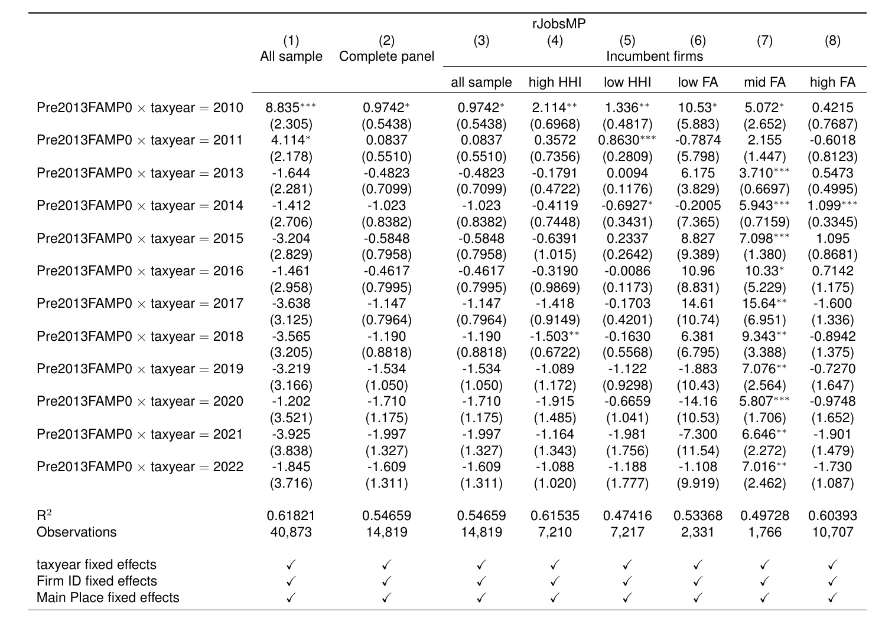
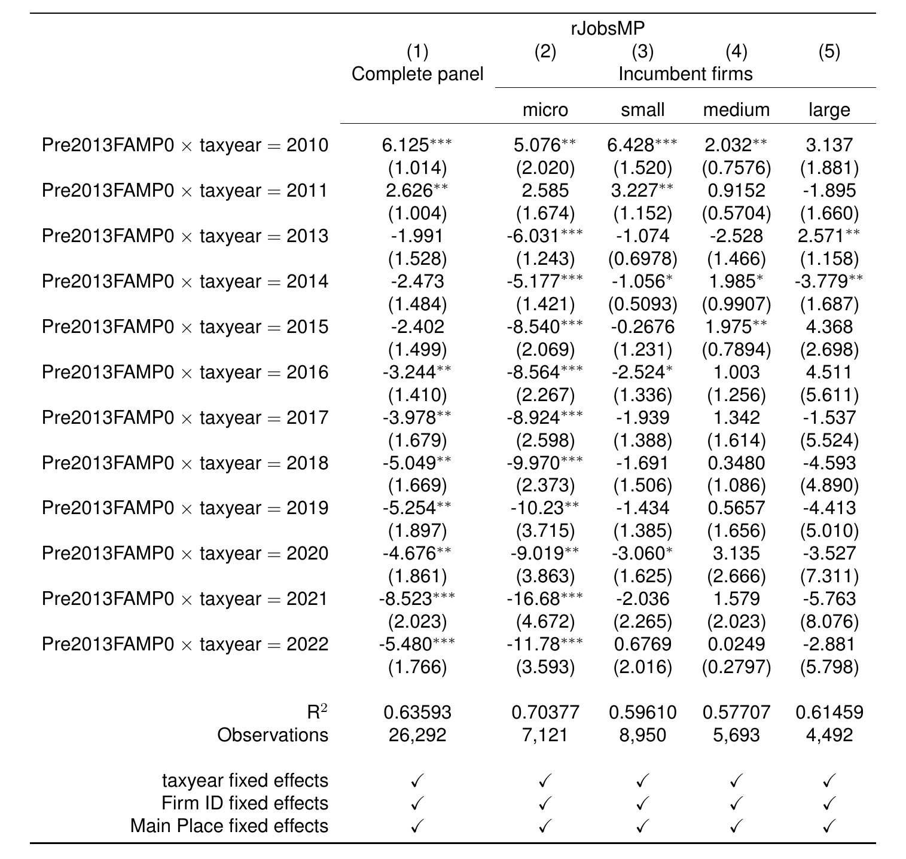
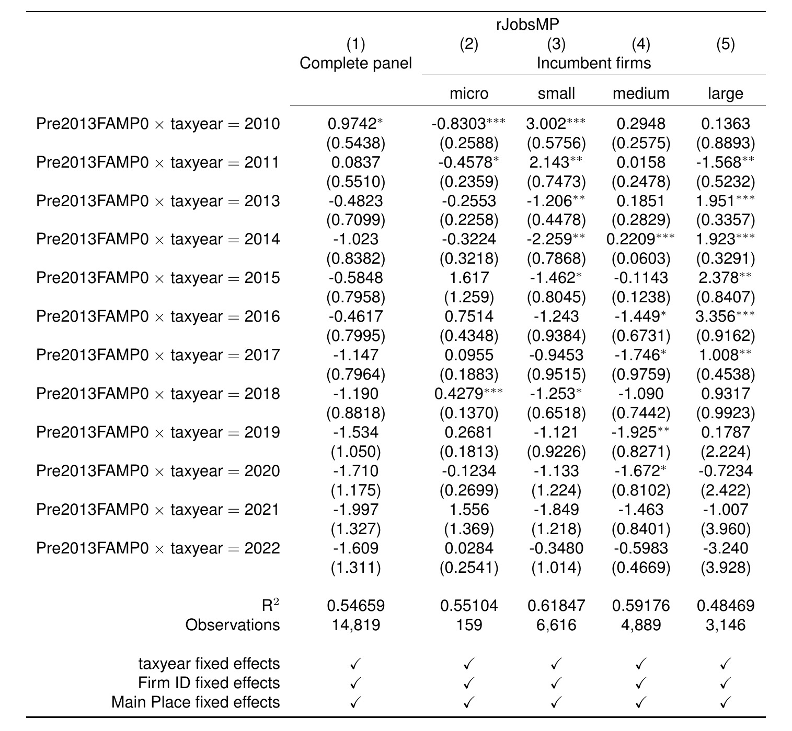
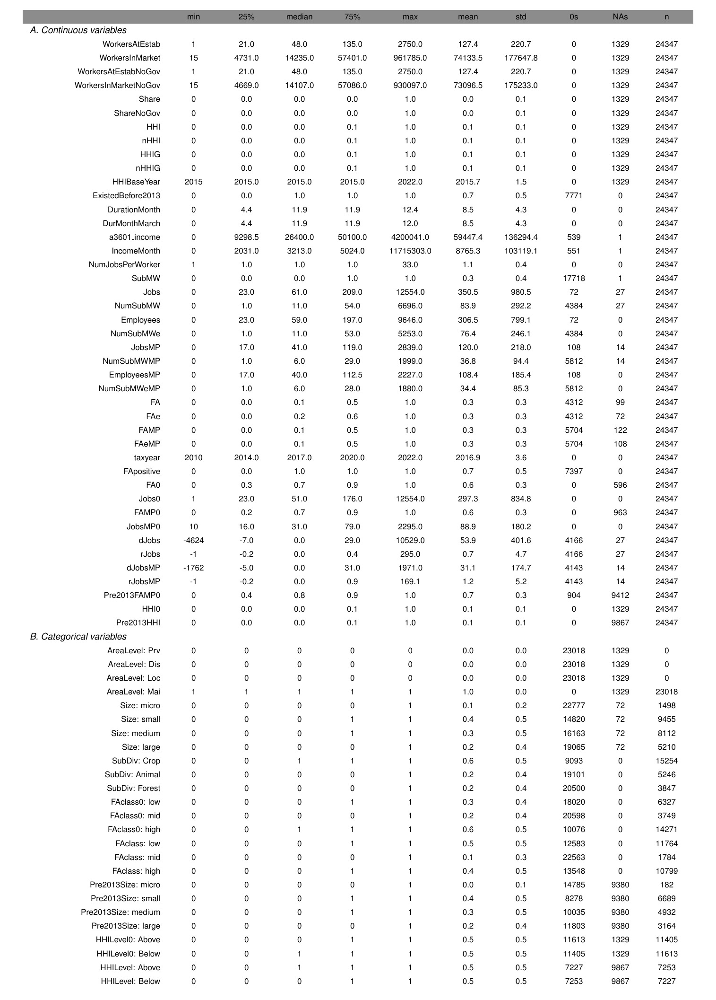

```{css CSS setting, echo=FALSE, results = "hide"}
.SeiroBenign {
  background-color: #FFEBCD;
  padding: 0.5em; /*文字まわり（上下左右）の余白*/
  /* border: 1px solid yellow; */
  /* font-weight: bold; */
}
.SeiroLightWreen {
  background-color: #D0F0C0; /* Tea green */
  padding: 0.5em; /*文字まわり（上下左右）の余白*/
  font-family: Noto Sans;
  /* border: 1px solid yellow; */
  /* font-weight: bold; */
}
/* Define a margin before hX (header level X) element */
h1  {
  margin-top: 3ex;
  margin-bottom: 3ex;
  /* background: #c2edff; */ /*背景色*/
  padding: 0.5em;/*文字まわり（上下左右）の余白*/
}
h2  {
  margin-top: 2ex;
  margin-bottom: 2ex;
  padding: 0.5em;/*文字周りの余白*/
  ####color: #010101;/*文字色*/
  color: #87a5f2;
  /* background: #eaf3ff; */ /*背景色*/
  /* border-bottom: solid 3px #516ab6; */ /*下線*/
}
DBlue {
  color: dodgerblue;
}
Blue {
  color: blue;
}
Red {
  color: red;
}
```

<style type="text/css">
  body, td{
  font-size: 16pt;
}
</style>

<!-- LaTeX math shortcode -->



```{r read setup from child file, child='../program/setupNoEcho.Rmd', message = F, warning = F}
```
```{r read functions from child file, child='../program/destatfactor.Rmd', message = F, warning = F}
```


# Introduction

Wages tend to lag behind the general price level. This is more evident when the competition between employers are stagnant in the local labour markets. Employers may take an advantage of their labour market power and withhold wages from catching up with the general price level. This becomes more important when the inflation rates are high. 

Reduced real wage rates increase poverty. This was the most prominent economic reason behind the farm workers' uprising of 2012 in the Western Cape Province of South Africa. Reacting to the labour unrest, Government of South Africa increased the minimum wage rate substantially.

Minimum wages had become a popular policy tool in the last decade. Many developed and developing countries increased the rates as a way to reduce poverty. It is a convenient tool for the policymakers as it does not require any funding beyond administrative and monioring costs. It is a convenient tool for the unions as eliminating a downside risk looks like a tangible gain. While being popular, their impacts on worker's well being are not fully understood especially in the developing countries where poverty is the policy target number one. 

The minimum wage impacts had long been debated in academia. After much ink had been spilled, a concensus is that its unemployment effects can be small, if exist [@Manning2021; @DubeLindner2024]. However, such concensus had emerged mostly out of studies on developed countries. Knowledge of minimum wages in developing countries is scarce and the impact estimates hardly generalise due to its diverse nature of socioeconomic conditions. We are still at the stage of piling up case study evidence from developing countries. 

In light of this, we take a large, 52% increase in the agricultural minimum wage of 2013 to study its impacts on unemployment. We use a comprehensive data set of all formal commercial establishments in South Africa. We show that the minimum wage increase reduced the job growth only  among the micro sized agriculural producers. Given that these producers mostly employ low income workers, the policy might have had adverse impacts on its targeted population. We use TWFE event study design estimator with continous treatments. 

In the next section, we review the background of agricultural minimum wages in South Africa. In Section 3, we discuss the previous literature, and in Section 4, a hypothesis is shown. Section 5 outlines the data set, Section 6 gives estimation method. Section 7 shows the results and Section 8 lays out conclusive remarks.  

# Agricultural minimum wages in South Africa

## Timeline

Minimum wage was introduced in South Africa's the agricultural sector in 2003. In the same year, the share of agriculture in employment was `r round((808/11823)*100, 2)`% [(LFS March 2003)](https://microdata.worldbank.org//catalog/940/download/23227). By 2012, `r round((685/13577)*100, 2)`% [(LFS Q4, 2012)](https://www.datafirst.uct.ac.za/dataportal/index.php/catalog/436/download/5647)

It employs over 900,000 workers out of 25 million of labour force, or `r round((920/25062)*100, 2)`%, or `r round((920/17055)*100, 2)`% of formal and informal employment in 2025 ([QLFLS 2025Q3, StastSA](https://www.statssa.gov.za/publications/P0211/P02113rdQuarter2025.pdf#page=6.43)).^[This contrasts with the goal of the National Development Plan of 2012 that aims to employ 1 million workers. ] Formal employment is 401,000 (`r round((401/11032)*100, 2)`% of total formal employment), informal employment is 519,000 (`r round((519/6023)*100, 2)`% of total informal employment). 

Due to the difference in living costs, there were two minimum wage rates applied to semi-rural and rural areas, which were later unified in 2008. At the introduction in 2003, it was mandated in the law that the minimum wage will adjust for inflation. Nevertheless, the adjustments were held incomplete in the semi-rural areas due to preparations for minimum wage unification, which was intended to slow down the catch up process of the rural areas to the semi-rural areas. The slower rate of inflation adjustments resulted in reduction of real minimum wage in semi-rural areas. This eventually gave rise to the farm worker's protests in November, 2012. In March 2013, the minimum wage rate was increased by 52% (R69 to R105 a day). The unignorable magnitude of the increase made the firms to undertake adjustment in production. The magnitude of this size gives researchers a ground to test employment impacts of minimum wages.

## Agriculture in South Africa

The employment share of agriculture is miniscule, yet these numbers obscure importance of agriculture in the rural area where densities of population and producers are low. For our purposes, the low share is convenient that we do not have to worry too much about the general equilibrium effects. Sparsely populated areas are also analytically convenient as it offers an environment that the firms may exert their labour market power. 

## Compliance 

The case for impact estimation of policy shocks rings horrow if the minimum wage was not enforced. It is argued that the compliance to the minimum wage law is incomplete in South Africa [@Bhorat2012; @Uma2013; @Bhorat2015]. Leniency to incompliance can be understood as a combination of: insufficient number of inspectors, peer effects, a high ratio of informal employment, fears of massive unemployment held by regulators, farms, and also a part of labour unions^[Employment Conditions Commission 2006. Report of the Employment Conditions Commission on the Investigation into the Farm Worker Sector with a View to Amend the Sectoral Determination 8 Farm Worker Sector, South Africa and to Respond to the Minister's Request to Investigate the Sector. Republic Of South Africa. ]. Given the incomplete compliance, we interpret the estimated results as an intention-to-treat (ITT) estimates. It has been shown that the compliance rates are rising through time in a five year period window [@Bhorat2015], which informs us to use the similar time horizon in estimating the impacts.


# Previous literature

Since the late 1990's, there has been a long debate on the unemployment impacts of minimum wages. The traditional view under a competitive labour market expected that the unemployment will increase as the minimum wages rise. The expectation did not match the empirical results, however. Summaries of evidence suggest that the unemployment impacts are relatively small, if they exist [@Manning2021; @DubeLindner2024]. 

@RaoRisch2026 relies on the data similar to this paper, the US Internal Revenues Services tax returns, and estimate the impacts of minimum wage increase.^[They use other data set, CPS MORGs, to compute each Census 2007 Code level industry's share in the total sub-minimum wage workers of the economy in one year before the minimum wage increase. They define the "highly exposed" industries where the industry's share exceeds 1%. It is a measure of relative concentration over the industries among total sub-minimum wage workers of the treated states, and is different from the fraction affected measure at each firm used by HarasztosiLindner2019 that we follow. Authors copy this information to 2017 NAICS 4-digit industry code used in IRS data through a [crosswalk file](https://www2.census.gov/programs-surveys/demo/guidance/industry-occupation/industry-crosswalk-90-00-02-07-12.xls). ] Focusing on pass-through corporations which consists of mostly small and medium scale but also includes a small number of large scale firms, they found small unemployment impacts, about -1.5 jobs per year per firm, mostly concentrated on teen part timers. A novel finding is that this small unemployment impact mostly stems from the vacancy positions that are left unfilled. They also found that profits are not affected. The majority of firms pass the cost increase to buyers. One concerning finding is that the job losses are found mostly among less productive (low value added per worker) firms which could not increase revenues by passing the costs to buyers just as the more productive firms did. 

It has always been argued that the labour markets may not be competitive [@Robinson1933; @Manning2013; @Manning2021ILRreview]. An early work discussed multiple channels that firms can adjust with, and firms can choose not to adjust on labour [@MaCurdy2015]. Even after narrowing the channel to labour market transactions, oligopsonistic firms still have a few options: laying off workers, labour-labour substituion^[Upgrading the skill contents of labour while keeping the level of employment. ] [@Horton2025], or reducing the firm's labour market transaction margins (wage markdowns). However, relatively few studies examine the adjustment channels beyond layoffs. This study aims to examine the plausibility of shrinking labour market margins. @Azaretal2023 are the first to examine this channel and use online labour market data of stock clerks, retail salespersons, and cashiers in the US. They find that labour market concentration as measured by Harhindahl-Hirschman Index (HHI) reduces the possible unemployment impacts of minimum wages. 

The monopsony story received some doubts when applied to a German data set. @FaiaLochnerSchoefer2026 uses the production approach to estimate the wage markdowns. They build a monopolistic competition model and derive an expression that shows the difference in markdowns before and after the minimum wage imposition. They show that the wage markdowns follow only 25% of what the monopsonistic model predicts. However,they use @AckerbergCavesFrazer2015 to estimate the gross output production function and use the estimated parameters to compute wage markdowns.^[ACF assumes Leontief-in-materials. Will results hold if they use GNR2020 to estimate the gross output production function? ] It remains to be seen if the results hold under more general conditions. 

Agricultural minimum wage in South Africa has been suggested to have reduced employment. An early study examines the introduction in 2003 and found noisy unemployment impacts [@BhoratKanburStanwix2014].^[Their results show stronger negative impacts on the part-time workers, hinting labour-labour substitution. ] Some studies use the different changes in minimum wages by region in 2008 to estimate the impacts. However, the estimates turned out to be noisy due possibly to a relatively small increase in minimum wages that provides only modest statistical power [@ChrisRulofRankin2015; @ItoSeiro2021e]. In the current study, we use the large increase in minimum wages in 2012 to estimate the impacts of minimum wages on employment and the possible mitigating factor of labour market power.

# Monopsony and unemployent impacts

We test if the labour market concentration, a proxy for labour market power, reduces the unemployment impacts of minimum wages. Under a standard theory, oligopsonistic firms can mitigate unemployment impacts of minimum wages through two channels: Increased labour supply and reduced wage markdowns [@BhaskarManningTo2002] (see @sec-monopsonist). 

The minimum wage for a monopsonist effectively transforms an upward sloping labour supply curve to a horizontal line. When the minimum wage is set lower than the competitive wage at the competitive employment level, it can result in an increased level of employment. In reality, marginal revenue curves differ across firms and there is an additional pressure on firms through competition between firms on the labour demand side, which dilute the positive employment response. Firms with low marginal revenue curves may exit the market. The end result is thus either negative or positive, while the scale of the impact may be muted from the pure competitive case or the pure monopsonist case. 

## Monopsonist responses to a minimum wage {#sec-monopsonist .appendix}

{#fig-Fig1 .column-margin width=80%}

Let us consider the monoposonist case for simplicity in @fig-Fig1. Prior to minimum wage imposition, profit-maximising employment is chosen at $L^{M}$ while the competitive employment is given at the level where $MR$ and labour supply curve intersect. Monopsonist employment is smaller than competitive employment. The wage markdown is given by $\frac{w^{M}}{\underline{w}}>1$. 

When the minimum wage is imposed at $\bar{w}$, the labour supply curve changes to the horizontal line at $\bar{w}$ for employment levels less than $\bar{L}$, because it is above the original labour supply curve. This means that the monopsonist will face an increased labour supply schedule. This leads to an increased employment which is accompanied by the reduced wage markdown from $\frac{w^{M}}{\underline{w}}$ to $\frac{MR(\bar{L})}{\bar{w}}$. 

# Data

## Sampling frame of CIT-IRP5 data set


This paper uses the matched employer-employee data from South Africa Revenue Services (SARS) administrative tax records between 2010 and 2022. The data contains information collected from job certificates (IRP5 forms) issued to individuals working in firms registered for pay-as-you-earn (PAYE) employee income tax. It contains information on remuneration, deductions, periods worked and geographical location. Industry information of the firm is extracted from the corporate income tax returns, which contain detailed balance sheet information on sales, cost of sales and profits, collected via the IT14/ITR14 tax forms.

The dataset covers all firms in South Africa that are registered with SARS and submit corporate income tax returns. This includes firms across all sectors of the formal economy, spanning small, medium, and large enterprises that are legally obliged to report taxes. Informal businesses that do not submit IT14/ITR14 forms are not included, which means that informal-sector firms and micro-enterprises operating entirely outside the tax system are excluded. From the employee perspective, the data capture all PAYE-registered employers that issue IRP5 tax certificates to workers earning above the reporting threshold. Firms and workers operating outside the PAYE and corporate income tax systems, such as informal businesses and microenterprises, are not included.

Our empirical analysis restricts the sample to firms operating in the agricultural 
sector, as identified using industry classifications reported in the corporate income tax returns. This restriction is applied to the universe of SARS-registered firms that submit IT14/ITR14 returns and can be linked to PAYE-registered employment through IRP5 certificates. The resulting sample therefore consists of formal agricultural enterprises with at least one PAYE-reported employee during the period of analysis. Informal agricultural producers, subsistence farms, and micro-enterprises that operate outside the corporate income tax and PAYE systems are not captured, nor are agricultural workers employed informally or on a casual basis without IRP5 reporting.

The number of jobs listed almost doubles from 2012 to 2013. Given the stagnant economy, it is not plausible to take this as the ground truth. Therefore, we fix the analysis's population to the firms listed in 2012. 


## HHI

We count the number of employees at the establishment level and construct HHI in the respetive regional labour markets. Firms use corporate tax IDs when they report income taxes to SARS. Firms also report their employee incomes to SARS with individual tax IDs and corporate tax IDs. SARS data are thus a matched employer-employee (MEE) data set. 

Firms report each establishments' geographical information. We can identify the firm branches up to the level of granularity in geographical information. The levels, from the most to the least granular, are Main Place, Local Municipality, District Municipality, and Province. We will use the least granular levels, Main Place, Local Municipality, and District Municipality, in defining HHI. In the current version (version 5) of data, merged (MEE) data set links all employees to the head quarter branch due to the limitation in the granularity of geographical information incorporated in the data. SARS MEE data (CIT-IRP5) is potent to identify exact branches of respective employees, yet its incorporation into the data set is scheduled in the future. 

IRP5, the individual income tax data set, contains corporate tax IDs and geographical information of their employers. We use the indivudual tax returns data IRP5 and its geographical information to measure employment over space and time.

<!--
In the CIT-IRP5 data set, all the employee information is linked to the head quarter branch, not the actual establishment they work at. So one needs to allocate the number of workers across establishments in a firm. We use establishment revenues in 2011 as weights. The advantage of this approach is that the sample size is retained. The disadvantage is we lose characteristics of individuals such as age or gender, and we can use such characteristics only at the firm level. An alternative approach we can take is to aggregate establishments and measure impacts at the firm level. The advantage is that we can use the individual characteristics of workers. The disadvantage is we lose establishment level variations and end up in smaller sample size. The former approach has a better chance of detecting the impacts due to stronger statistical power. The latter approach has a better chance of interpreting the impacts due to more detailed information of workers. Therefore, we will use both approaches. 
-->

{#fig-HHI2012byAreaLevel .column-margin width=80%}

Distributions of HHIs at various geographical levels are shown in the @fig-HHI2012byAreaLevel. We compute HHI by assuming that the administrative areas are the local labour markets. I.e., under the assumption that the labour markets in a Province are integrated, we compute shares in jobs of all establishments in the Province, and compute a single HHI of the Province. We follow the same procedure at each administrative levels, District Municipality, Local Municipality, and Main Place. 

As expected, Provincial level HHI is concentrated at low values. It is unrealistic to assume the labour markets are integrated at this large area level. We note that the distributions of HHIs at District and Local Municipality levels are similar. This indicates that District Municipalities consist of few major Local Municipalities, and  using both levels interchangeably will not give severely biased results. The distribution at the Main Place level is more dispersed and provides more variations. We can use both Main Place and Local Municipality level HHIs and see which levels are more related to unemployment impacts.


## Job trends

The IRP5 data have information of jobs paid by firms. The jobs are created on both the permanent and temporary basis. Jobs are different from employment. They are informationally richer than the employment, because the information cotents are finer and the number is no smaller. 

Our data set does not have information on self-employed firms or a manager-employer firms, because they do not report paid jobs that they hire. These are typically operating at a micro scale and its majority is considered to be subsistent farming.^[Subsistent farming is estimated to employ about 2 million people in SA (Table 8, QLFS2025Q3, StatsSA). Time-related underemployment, defined as employment [less than 35 hours and desired to work more](https://www.statistics.gov.hk/wsc/CPS203-P15-S.pdf#page=2), amounts to 21,000 workers (Table 3.9, QLFS2025Q3, StatsSA). ] The data also do not cover outsourced labour, because the hiring agents may not list themselves as agrictultural firms. According to QLFS, informal employment in agriculture (519,000) is larger than formal employment (401,000). This contrasts with the aggregate employment where 11,032,000 work in the formal sector and 6,023,000 work in the informal sector. Thus the share of agriculture is higher in the informal sector (`r round((519/6023)*100, 2)`%) than the formal sector (`r round((401/11032)*100, 2)`%), with the aggregate share at `r round((519+401)/(6023+11032)*100, 2)`%. Given the tendency of lower wages in the informal sector, the higher ratio of informal activities makes agricultural minimum wage difficult to implement.

::::{.fullwidth}
::: {.content-visible when-format="html"}
{#fig-rJobsBySubindustryw}
:::
::::

::: {.content-visible when-format="pdf"}
\mpage{.8\textwidth}{
\hfil\textsc{\footnotesize Figure \refstepcounter{figure}\thefigure: Mean number of jobs relative to initial level in subindustries of agriculture and FA, 2010-2022 \label{fig-rJobsBySubindustryw}}

\includegraphics[width=.8\textwidth]{../program/figures/2026Mar18/rJobsBySubindustry_w.jpg}
}
:::


`r  if (knitr::is_html_output()) "@fig-rJobsBySubindustryw" else "\\textsc{\\footnotesize Figure \\ref{fig-rJobsBySubindustryw}}"` shows mean change in the number of jobs relative to its initial value in each establishment, (jobs - initial jobs)/(initial jobs). In the top row, we show overall mean of agrincture. The plot shows three classes by the degree of minimum wage exposure,defined as (number of jobs affected below the new minimum wage level)/(total number of jobs) both in pre-2013, `Pre2013FAMP0`; low (below 20%), mid (20-50%), and high (above 50%). It shows that the jobs are increasing between 2010 and 2013, increasing by about 150% relative to its initial level, then the secular rising trend stops in 2014 and hovers around at 200% level until 2022. We understand this as an increasing pre-trend that stopped after 2013. 

When we look at the difference between FA classes (high vs. mid), we see that job growth rate of mid class is almost alway larger. This indicates the lower (negative) relative job growth of high FA class. However, this is not the case against low FA class, so one cannot immediately see that the minimum wage increase had a more negative impacts on the high FA class. We will need to use estimation to understand more precisely.


# Estimation strategy

We use TWFE event study estimator. The event study estimator requires time-varying estimates on treatment assignment. 

<!--
In a matrix form, I need Group $$
G=\left(
\begin{array}{cccc}
1 & 0 & \dots & 0\\
\vdots & \vdots &  & \vdots \\
1 & 0 & \dots & 0\\
0 & 1 & \dots & 0\\
\vdots & \vdots &  & \vdots \\
0 & 1 & \dots & 0\\
0 & 0 & \dots & 0\\
\vdots & \vdots &  & \vdots \\
0 & 0 & \dots & 0\\
0 & 0 & \dots & 1\\
\vdots & \vdots &  & \vdots \\
0 & 0 & \dots & 1
\end{array}
\right)
$$ with
$$
\left[
\begin{array}{ccc}
\bfg_{1}\bfB & \dots & gG\bfB
\end{array}
\right]
$$

If I want to have an interaction of group $\times$ some matrix, 
we need
$$
G=\left(
\begin{array}{cccc}
\bfB_{1} & \0       & \dots  & \0\\
\0       & \bfB_{2} & \dots  & \0\\
\vdots   & \vdots   & \ddots & \vdots\\
\0       & \0       & \dots  & \bfB_{T}\\
\end{array}
\right)
$$ 
T $\times$ (K$\times$T) matrix

```{r }
x <- matrix(1:100, ncol = 4)
x1 <- x[1:5, ]
x2 <- x[6:15, ]
x3 <- x[16:25, ]
G <- Matrix::bdiag(list(x1, x2, x3))
G
as.matrix(G)
Interact <- function(x, group) {
####     x: matrix to be divided over groups
#### group: 1, 1, ..., 1, 2, 2, ..., 2, 3, ...

}

```


A Kronecker product $\bfA\otimes\bfB$ is
$$
\left[
\begin{array}{ccc}
a_{11}\bfB & \dots & a_{1K}\bfB\\
 & \ddots & \\
a_{L1}\bfB & \dots & a_{LK}\bfB\\
\end{array}
\right]
$$
-->

We estimate parameters at the industry subdividion (SIC-7 code at 2 digits) level:
\begin{equation}
\begin{aligned}
y_{ijrt} 
= a_{0}
&+a_{1it}FA_{ijr0}+a_{2it}H_{ijr0}+a_{3it}FA_{ijr0}H_{ijr0}\\
&+c_{i}+c_{j}+c_{r}+c_{t}+e_{ijrt}
\end{aligned}
\label{esteqn}
\end{equation}

For industry subdivision $i$, firm $j$ in region $r$ in period $t$, $y_{ijrt}$ is an outcome variable, $FA_{ijr0}$ is a fraction of affected workers among all workers or a treatment exposure rate at period zero, $H_{ijr0}$ is HHI of employment in region $r$ at period zero, $c_{i}$, $c_{j}, c_{r}$ and $c_{t}$ are four-way fixed effects in industry subdivisions, firms, regions, and periods, and $e_{ijrt}$ is an idiosyncratic error. $a_{1it}$ captures the classical wage increase impacts which we expect to be negative, and $a_{3it}$ gives the estimate of interest, the unemployment reduction impacts of labour market concentration. We follow @HarasztosiLindner2019 in transforming the LHS of \eqref{esteqn} in percentages, so $a_{1it}$ becomes an elasticity of the minimum wage and $a_{3it}$ is the change in the elasticity.

This is basically a DID with continuous treatment. The underlying identification assumption behind \eqref{esteqn} is the common trend in $y_{ijrt}$ at all the levels of $FA_{ijr0}$. A natural justification is that the economy is in the steady state so all the level variables grow at the same rate for all firms. Empirically, it suffices to assume that the firm's outcome growth to follow some probability distribution with the common mean. This intuition turns out to be correct and is formally derived in @Callawayetal2025^[It is summarised as the strong parallel trends assumption. ]. They also caution against using the two-way fixed effect specification, because the dose $FA$ levels around the mean receive high weights regardless of how the dose distribution looks like. They recommend the raw (nonparametric) DID estimation of ATE. We use the raw DID as a part of robustness checks.

We allow the estimated coefficients to be time variant. This gives an event-study like interpretation, or a cumulative impact interpretation, of the estimated impacts. Given the dynamic adjustment process of firms, this flexibility will give us more nuanced interpretation of impacts.

For efficiency, we follow @Azaretal2023 and restrict the coefficients to be the same across industries by using the regional mean HHI $\bar{H}_{jr0}$ of all industries^[Azar et al. (2023) used means of $H$ over three occupations at the county level. ]. This is to assume the regional labour markets are integrated at the sic-7's 1 digit (broadly defined agriculture industry) level, estimating the parameters at the broadly defined agriculture industry level by dropping $i$ subscripts in $H$:^[Azar et al. (2023) uses both overall (across periods and occupation-markets) county mean and pre-period  (across occupation-markets) county mean as HHI. They show that overall county means are not correlated with minimum wages so endogeneity of mean HHI to outcomes through minimum wages is not a concern. ]
\begin{equation}
\begin{aligned}
y_{ijrt} 
= a_{0}
&+a_{1t}FA_{ijr0}+a_{2t}\bar{H}_{jr0}+a_{3t}FA_{ijr0}\bar{H}_{jr0}\\
&+c_{i}+c_{j}+c_{t}+e_{ijrt}
\end{aligned}
\label{esteqn2}
\end{equation}


# Results


## Main results


<!--
::::{.fullwidth}
::: {.content-visible when-format="html"}






:::

::: {.content-visible when-format="pdf"}
\hspace{-1cm}\mpage{.8\pagewidth}{

  \mpage{.8\pagewidth}{
    \hfil\textsc{\footnotesize Figure \refstepcounter{figure}\thefigure: Results: 2010-2022, establishments with baseline jobs greater than 2 by HHI \label{tab gFE201002LHw}}\\
    \includegraphics[width=.9\textwidth]{../program/figures/2026Mar17/Results2010-2022Job02LowHighw.jpg}
  }

  \mpage{.8\pagewidth}{
    \hfil\textsc{\footnotesize Figure \refstepcounter{figure}\thefigure: Results: 2010-2022, establishments with baseline jobs greater than 10 by HHI \label{tab gFE201010LHw}}\\
    \includegraphics[width=.9\textwidth]{../program/figures/2026Mar17/Results2010-2022Job10LowHighw.jpg}
  }
}
:::

::: {.content-visible when-format="pdf"}
\hspace{-1cm}\mpage{.8\pagewidth}{
  \mpage{.8\pagewidth}{
    \hfil\textsc{\footnotesize Figure \refstepcounter{figure}\thefigure: Results: 2010-2022, establishments with baseline jobs greater than 2 by FA \label{tab gFE201002FAclassw}}\\
    \includegraphics[width=.9\textwidth]{../program/figures/2026Mar17/Results2010-2022Job02FAclassw.jpg}
  }

  \mpage{.8\pagewidth}{
    \hfil\textsc{\footnotesize Figure \refstepcounter{figure}\thefigure: Results: 2010-2022, establishments with baseline jobs greater than 10 by FA \label{tab gFE201010FAclassw}}\\
    \includegraphics[width=.9\textwidth]{../program/figures/2026Mar17/Results2010-2022Job10FAclassw.jpg}
  }
}
:::
::::
-->

{#fig-Results2010-2022Job02LowHighw}

{#fig-Results2010-2022Job10LowHighw}

@fig-Results2010-2022Job02LowHighw shows the estimates $a_{3t}$ on the sample of establishments that have at least 2 jobs at pre-2013 period. @fig-Results2010-2022Job10LowHighw is for the sample with at least 10 jobs at pre-2013 period. For both samples, the all sample estimates (most left panels in each figures) have negative trends. This is in line with our finding of decreased mean job growth by FA class when we compare high versus mid. So the job growth stagnated for highly exposed establishments when we compare to modestly exposed establishments. 

When we compare the results between high concentrated markets and low concentrated markets, we see similar downward point estimates but only low concentrated markets are estimated precisely. We can clearly see that low concentrated markets reduced the jobs since the minimum wage increase, while we cannot see it for high concentrated markets. It is not inconsistent with oligopsony hypothesis of reduced unemployment, however, there is nothing more we can draw from the results. The inconclusiveness is strengthened for the sample of 10 jobs or more.

{#fig-Results2010-2022Job02FAclassw}

{#fig-Results2010-2022Job10FAclassw}

@fig-Results2010-2022Job02FAclassw and @fig-Results2010-2022Job10FAclassw show the results by FA class. These show that negative impacts on job growth is not found once we group them by exposure. In fact, most exposed establishments held their job level unchanged. Moderately exposed establishments increased their job growth after the minimum wage change. 

{#fig-Results2010-2022Job02Sizew}

{#fig-Results2010-2022Job10Sizew}

@fig-Results2010-2022Job02Sizew and @fig-Results2010-2022Job10Sizew show impacts by job size at the baseline. Firms are classified by the number of employees into micro (below 10), small (10-49), medium (50-249), and large (250-). We applied the classification on the number of jobs. These figures show that the negative impacts mostly come from the micro establishments. In fact, @tbl-est201002Sizew and @tbl-est201010Sizew in Appendix show a pattern that job growth increased among larger establishments and reduced among smaller establishments. 

<!--
## Robustness checks
-->

# Conclusion


We focused on the impacts of large minimum wage increase of 2013 in South Africa to examine its impacts on jobs. We used matched employee-employer data set and applied TWFE continuous treatment event study design estimator. We found the impacts on jobs to be weakly negative overall, and the negative impacts mostly come from the micro establishments.  

The adverse impacts on the very population targeted raises many questions. In the future steps, we will examine the impacts by job type (temporary, fixed term, permanent), by size and HHI, and on employment. 


# Appendix A {.appendix .unnumbered}

\setlength{\tabcolsep}{.5pt}

## Main results

### By concentration and FA class

```{r ltx201002w, include = F}
ltx201002w <- "\\begin{tabular}{lcccccccc}
   \\toprule
    & \\multicolumn{8}{c}{rJobsMP}\\\\
                                           & (1)           & (2)            & (3)            & (4)            & (5)            & (6)           & (7)           & (8)\\\\  
    &  All sample & Complete panel & \\multicolumn{6}{c}{Incumbent firms} \\\\
   \\cline{4-9} 
    & \\multicolumn{8}{c}{}\\\\[-1ex]
    &   &  & all sample & high HHI & low HHI & low FA & mid FA & high FA \\\\
   \\cline{2-9} 
    & \\multicolumn{8}{c}{}\\\\[-1ex]
   Pre2013FAMP0 $\\times$ taxyear $=$ 2010  & 8.835$^{***}$ & 6.125$^{***}$  & 6.125$^{***}$  & 7.933$^{***}$  & 3.331$^{***}$  & 61.77         & -9.496        & 2.233\\\\   
                                           & (2.305)       & (1.014)        & (1.014)        & (1.465)        & (0.7629)       & (36.79)       & (9.815)       & (1.522)\\\\   
   Pre2013FAMP0 $\\times$ taxyear $=$ 2011  & 4.114$^{*}$   & 2.626$^{**}$   & 2.626$^{**}$   & 2.640$^{***}$  & 1.565$^{*}$    & 46.25         & -5.413        & -3.065\\\\   
                                           & (2.178)       & (1.004)        & (1.004)        & (0.6336)       & (0.8186)       & (36.86)       & (7.235)       & (2.836)\\\\   
   Pre2013FAMP0 $\\times$ taxyear $=$ 2013  & -1.644        & -1.991         & -1.991         & -3.966         & -1.096$^{**}$  & 10.62         & -8.058        & 3.173$^{***}$\\\\   
                                           & (2.281)       & (1.528)        & (1.528)        & (2.503)        & (0.4457)       & (38.76)       & (5.557)       & (0.6645)\\\\   
   Pre2013FAMP0 $\\times$ taxyear $=$ 2014  & -1.412        & -2.473         & -2.473         & -3.497         & -2.835$^{***}$ & 4.518         & -8.976        & 4.396$^{***}$\\\\   
                                           & (2.706)       & (1.484)        & (1.484)        & (2.318)        & (0.6657)       & (38.97)       & (5.240)       & (0.2432)\\\\   
   Pre2013FAMP0 $\\times$ taxyear $=$ 2015  & -3.204        & -2.402         & -2.402         & -2.951         & -2.720$^{**}$  & 1.289         & 0.9528        & 7.759$^{***}$\\\\   
                                           & (2.829)       & (1.499)        & (1.499)        & (2.143)        & (0.9053)       & (37.87)       & (15.17)       & (2.463)\\\\   
   Pre2013FAMP0 $\\times$ taxyear $=$ 2016  & -1.461        & -3.244$^{**}$  & -3.244$^{**}$  & -3.213         & -4.064$^{***}$ & -6.806        & 9.241         & 10.31$^{*}$\\\\   
                                           & (2.958)       & (1.410)        & (1.410)        & (1.898)        & (0.9671)       & (38.37)       & (18.61)       & (5.535)\\\\   
   Pre2013FAMP0 $\\times$ taxyear $=$ 2017  & -3.638        & -3.978$^{**}$  & -3.978$^{**}$  & -5.195$^{*}$   & -3.697$^{***}$ & -4.660        & 11.04         & 7.980$^{*}$\\\\   
                                           & (3.125)       & (1.679)        & (1.679)        & (2.609)        & (0.9420)       & (38.83)       & (21.16)       & (4.402)\\\\   
   Pre2013FAMP0 $\\times$ taxyear $=$ 2018  & -3.565        & -5.049$^{**}$  & -5.049$^{**}$  & -6.661$^{**}$  & -4.161$^{***}$ & -12.78        & -14.77$^{**}$ & 6.244$^{*}$\\\\   
                                           & (3.205)       & (1.669)        & (1.669)        & (2.388)        & (1.129)        & (39.72)       & (5.680)       & (3.090)\\\\\   
   Pre2013FAMP0 $\\times$ taxyear $=$ 2019  & -3.219        & -5.254$^{**}$  & -5.254$^{**}$  & -6.501$^{*}$   & -4.906$^{***}$ & -19.34        & -10.56        & 6.772$^{*}$\\\\   
                                           & (3.166)       & (1.897)        & (1.897)        & (3.070)        & (1.273)        & (41.92)       & (10.17)       & (3.171)\\\\   
   Pre2013FAMP0 $\\times$ taxyear $=$ 2020  & -1.202        & -4.676$^{**}$  & -4.676$^{**}$  & -4.516$^{*}$   & -5.776$^{***}$ & -26.91        & -8.365        & 13.87$^{**}$\\\\   
                                           & (3.521)       & (1.861)        & (1.861)        & (2.529)        & (1.827)        & (41.10)       & (9.151)       & (6.224)\\\\   
   Pre2013FAMP0 $\\times$ taxyear $=$ 2021  & -3.925        & -8.523$^{***}$ & -8.523$^{***}$ & -9.746$^{***}$ & -7.855$^{***}$ & -51.35        & -1.057        & 13.22$^{**}$\\\\   
                                           & (3.838)       & (2.023)        & (2.023)        & (2.804)        & (2.298)        & (42.94)       & (7.283)       & (6.021)\\\\   
   Pre2013FAMP0 $\\times$ taxyear $=$ 2022  & -1.845        & -5.480$^{***}$ & -5.480$^{***}$ & -7.077$^{***}$ & -5.082$^{**}$  & -24.78        & 0.4629        & 8.661$^{*}$\\\\   
                                           & (3.716)       & (1.766)        & (1.766)        & (2.074)        & (1.920)        & (41.99)       & (7.979)       & (4.384)\\\\   
    \\\\
   R$^2$                                   & 0.61821       & 0.63593        & 0.63593        & 0.67566        & 0.61562        & 0.63219       & 0.59962       & 0.69126\\\\  
   Observations                            & 40,873        & 26,292         & 26,292         & 13,009         & 12,511         & 7,827         & 3,729         & 14,695\\\\  
    \\\\
   taxyear fixed effects                   & $\\checkmark$  & $\\checkmark$   & $\\checkmark$   & $\\checkmark$   & $\\checkmark$   & $\\checkmark$  & $\\checkmark$  & $\\checkmark$\\\\   
   Firm ID fixed effects                   & $\\checkmark$  & $\\checkmark$   & $\\checkmark$   & $\\checkmark$   & $\\checkmark$   & $\\checkmark$  & $\\checkmark$  & $\\checkmark$\\\\   
   Main Place fixed effects                & $\\checkmark$  & $\\checkmark$   & $\\checkmark$   & $\\checkmark$   & $\\checkmark$   & $\\checkmark$  & $\\checkmark$  & $\\checkmark$\\\\   
   \\bottomrule
\\end{tabular}
"
```

```{r ltx201010w, include = F}
ltx201010w <- "\\begin{tabular}{lcccccccc}
   \\toprule
    & \\multicolumn{8}{c}{rJobsMP}\\\\
                                           & (1)           & (2)           & (3)           & (4)           & (5)            & (6)           & (7)           & (8)\\\\  
    &  All sample & Complete panel & \\multicolumn{6}{c}{Incumbent firms} \\\\
   \\cline{4-9} 
    & \\multicolumn{8}{c}{}\\\\[-1ex]
    &   &  & all sample & high HHI & low HHI & low FA & mid FA & high FA \\\\
   \\cline{2-9} 
    & \\multicolumn{8}{c}{}\\\\[-1ex]
   Pre2013FAMP0 $\\times$ taxyear $=$ 2010  & 8.835$^{***}$ & 0.9742$^{*}$  & 0.9742$^{*}$  & 2.114$^{**}$  & 1.336$^{**}$   & 10.53$^{*}$   & 5.072$^{*}$   & 0.4215\\\\   
                                           & (2.305)       & (0.5438)      & (0.5438)      & (0.6968)      & (0.4817)       & (5.883)       & (2.652)       & (0.7687)\\\\   
   Pre2013FAMP0 $\\times$ taxyear $=$ 2011  & 4.114$^{*}$   & 0.0837        & 0.0837        & 0.3572        & 0.8630$^{***}$ & -0.7874       & 2.155         & -0.6018\\\\   
                                           & (2.178)       & (0.5510)      & (0.5510)      & (0.7356)      & (0.2809)       & (5.798)       & (1.447)       & (0.8123)\\\\   
   Pre2013FAMP0 $\\times$ taxyear $=$ 2013  & -1.644        & -0.4823       & -0.4823       & -0.1791       & 0.0094         & 6.175         & 3.710$^{***}$ & 0.5473\\\\   
                                           & (2.281)       & (0.7099)      & (0.7099)      & (0.4722)      & (0.1176)       & (3.829)       & (0.6697)      & (0.4995)\\\\   
   Pre2013FAMP0 $\\times$ taxyear $=$ 2014  & -1.412        & -1.023        & -1.023        & -0.4119       & -0.6927$^{*}$  & -0.2005       & 5.943$^{***}$ & 1.099$^{***}$\\\\   
                                           & (2.706)       & (0.8382)      & (0.8382)      & (0.7448)      & (0.3431)       & (7.365)       & (0.7159)      & (0.3345)\\\\   
   Pre2013FAMP0 $\\times$ taxyear $=$ 2015  & -3.204        & -0.5848       & -0.5848       & -0.6391       & 0.2337         & 8.827         & 7.098$^{***}$ & 1.095\\\\   
                                           & (2.829)       & (0.7958)      & (0.7958)      & (1.015)       & (0.2642)       & (9.389)       & (1.380)       & (0.8681)\\\\   
   Pre2013FAMP0 $\\times$ taxyear $=$ 2016  & -1.461        & -0.4617       & -0.4617       & -0.3190       & -0.0086        & 10.96         & 10.33$^{*}$   & 0.7142\\\\   
                                           & (2.958)       & (0.7995)      & (0.7995)      & (0.9869)      & (0.1173)       & (8.831)       & (5.229)       & (1.175)\\\\   
   Pre2013FAMP0 $\\times$ taxyear $=$ 2017  & -3.638        & -1.147        & -1.147        & -1.418        & -0.1703        & 14.61         & 15.64$^{**}$  & -1.600\\\\   
                                           & (3.125)       & (0.7964)      & (0.7964)      & (0.9149)      & (0.4201)       & (10.74)       & (6.951)       & (1.336)\\\\   
   Pre2013FAMP0 $\\times$ taxyear $=$ 2018  & -3.565        & -1.190        & -1.190        & -1.503$^{**}$ & -0.1630        & 6.381         & 9.343$^{**}$  & -0.8942\\\\   
                                           & (3.205)       & (0.8818)      & (0.8818)      & (0.6722)      & (0.5568)       & (6.795)       & (3.388)       & (1.375)\\\\   
   Pre2013FAMP0 $\\times$ taxyear $=$ 2019  & -3.219        & -1.534        & -1.534        & -1.089        & -1.122         & -1.883        & 7.076$^{**}$  & -0.7270\\\\   
                                           & (3.166)       & (1.050)       & (1.050)       & (1.172)       & (0.9298)       & (10.43)       & (2.564)       & (1.647)\\\\   
   Pre2013FAMP0 $\\times$ taxyear $=$ 2020  & -1.202        & -1.710        & -1.710        & -1.915        & -0.6659        & -14.16        & 5.807$^{***}$ & -0.9748\\\\   
                                           & (3.521)       & (1.175)       & (1.175)       & (1.485)       & (1.041)        & (10.53)       & (1.706)       & (1.652)\\\\   
   Pre2013FAMP0 $\\times$ taxyear $=$ 2021  & -3.925        & -1.997        & -1.997        & -1.164        & -1.981         & -7.300        & 6.646$^{**}$  & -1.901\\\\   
                                           & (3.838)       & (1.327)       & (1.327)       & (1.343)       & (1.756)        & (11.54)       & (2.272)       & (1.479)\\\\   
   Pre2013FAMP0 $\\times$ taxyear $=$ 2022  & -1.845        & -1.609        & -1.609        & -1.088        & -1.188         & -1.108        & 7.016$^{**}$  & -1.730\\\\   
                                           & (3.716)       & (1.311)       & (1.311)       & (1.020)       & (1.777)        & (9.919)       & (2.462)       & (1.087)\\\\   
    \\\\
   R$^2$                                   & 0.61821       & 0.54659       & 0.54659       & 0.61535       & 0.47416        & 0.53368       & 0.49728       & 0.60393\\\\  
   Observations                            & 40,873        & 14,819        & 14,819        & 7,210         & 7,217          & 2,331         & 1,766         & 10,707\\\\  
    \\\\
   taxyear fixed effects                   & $\\checkmark$  & $\\checkmark$  & $\\checkmark$  & $\\checkmark$  & $\\checkmark$   & $\\checkmark$  & $\\checkmark$  & $\\checkmark$\\\\   
   Firm ID fixed effects                   & $\\checkmark$  & $\\checkmark$  & $\\checkmark$  & $\\checkmark$  & $\\checkmark$   & $\\checkmark$  & $\\checkmark$  & $\\checkmark$\\\\   
   Main Place fixed effects                & $\\checkmark$  & $\\checkmark$  & $\\checkmark$  & $\\checkmark$  & $\\checkmark$   & $\\checkmark$  & $\\checkmark$  & $\\checkmark$\\\\   
   \\bottomrule
\\end{tabular}
"
```


```{r evaluate latex in html2}
#| eval: !expr knitr::is_html_output() 
#| out.width: "800px"
#| results: "hide"
#| warning: false
library(texPreview)
tex_preview(ltx201002w, 
  usrPackages = c('\\usepackage{booktabs}', '\\usepackage{amssymb}'), 
  returnType = 'html', 
  density = 300,
  resizebox = T,
  fileDir = "c:/data/MinWageMarketPower/analysis/draft/", 
  keep_pdf = T,
  imgFormat = "jpg",
  stem = "est201002w")
tex_preview(ltx201010w, 
  usrPackages = c('\\usepackage{booktabs}', '\\usepackage{amssymb}'), 
  returnType = 'html', 
  density = 300,
  resizebox = T,
  fileDir = "c:/data/MinWageMarketPower/analysis/draft/", 
  keep_pdf = T,
  imgFormat = "jpg",
  stem = "est201010w")
```

::::{.fullwidth}
::: {.content-visible when-format="html"}
{#tbl-est201002w}

{#tbl-est201010w}
:::
::::

::::{.column-page}
::: {.content-visible when-format="pdf"}
```{r render_pdf, results="asis"}
#| eval: false # !expr knitr::is_latex_output()
#| out.width: "400px"
#| column: body-outset
#### For PDF, we just dump the raw LaTeX string into the document
cat(ltx)
```
:::
::::


::: {.content-visible when-format="pdf"}
\hspace{-2cm}\mpage{.8\pagewidth}{
\hfil\textsc{\footnotesize Table \refstepcounter{table}\thetable: Results: 2010-2022, establishments with baseline jobs greater than 2 \label{tab est201002w}}

  \adjustbox{max width=.8\pagewidth}{
\begin{tabular}{lcccccccc}
   \toprule
    & \multicolumn{8}{c}{rJobsMP}\\
                                           & (1)           & (2)            & (3)            & (4)            & (5)            & (6)           & (7)           & (8)\\  
    &  All sample & Complete panel & \multicolumn{6}{c}{Incumbent firms} \\
   \cline{4-9} 
    & \multicolumn{8}{c}{}\\[-1ex]
    &   &  & all sample & high HHI & low HHI & low FA & mid FA & high FA \\
   \cline{2-9} 
    & \multicolumn{8}{c}{}\\[-1ex]
   Pre2013FAMP0 $\times$ taxyear $=$ 2010  & 8.835$^{***}$ & 6.125$^{***}$  & 6.125$^{***}$  & 7.933$^{***}$  & 3.331$^{***}$  & 61.77         & -9.496        & 2.233\\   
                                           & (2.305)       & (1.014)        & (1.014)        & (1.465)        & (0.7629)       & (36.79)       & (9.815)       & (1.522)\\   
   Pre2013FAMP0 $\times$ taxyear $=$ 2011  & 4.114$^{*}$   & 2.626$^{**}$   & 2.626$^{**}$   & 2.640$^{***}$  & 1.565$^{*}$    & 46.25         & -5.413        & -3.065\\   
                                           & (2.178)       & (1.004)        & (1.004)        & (0.6336)       & (0.8186)       & (36.86)       & (7.235)       & (2.836)\\   
   Pre2013FAMP0 $\times$ taxyear $=$ 2013  & -1.644        & -1.991         & -1.991         & -3.966         & -1.096$^{**}$  & 10.62         & -8.058        & 3.173$^{***}$\\   
                                           & (2.281)       & (1.528)        & (1.528)        & (2.503)        & (0.4457)       & (38.76)       & (5.557)       & (0.6645)\\   
   Pre2013FAMP0 $\times$ taxyear $=$ 2014  & -1.412        & -2.473         & -2.473         & -3.497         & -2.835$^{***}$ & 4.518         & -8.976        & 4.396$^{***}$\\   
                                           & (2.706)       & (1.484)        & (1.484)        & (2.318)        & (0.6657)       & (38.97)       & (5.240)       & (0.2432)\\   
   Pre2013FAMP0 $\times$ taxyear $=$ 2015  & -3.204        & -2.402         & -2.402         & -2.951         & -2.720$^{**}$  & 1.289         & 0.9528        & 7.759$^{***}$\\   
                                           & (2.829)       & (1.499)        & (1.499)        & (2.143)        & (0.9053)       & (37.87)       & (15.17)       & (2.463)\\   
   Pre2013FAMP0 $\times$ taxyear $=$ 2016  & -1.461        & -3.244$^{**}$  & -3.244$^{**}$  & -3.213         & -4.064$^{***}$ & -6.806        & 9.241         & 10.31$^{*}$\\   
                                           & (2.958)       & (1.410)        & (1.410)        & (1.898)        & (0.9671)       & (38.37)       & (18.61)       & (5.535)\\   
   Pre2013FAMP0 $\times$ taxyear $=$ 2017  & -3.638        & -3.978$^{**}$  & -3.978$^{**}$  & -5.195$^{*}$   & -3.697$^{***}$ & -4.660        & 11.04         & 7.980$^{*}$\\   
                                           & (3.125)       & (1.679)        & (1.679)        & (2.609)        & (0.9420)       & (38.83)       & (21.16)       & (4.402)\\   
   Pre2013FAMP0 $\times$ taxyear $=$ 2018  & -3.565        & -5.049$^{**}$  & -5.049$^{**}$  & -6.661$^{**}$  & -4.161$^{***}$ & -12.78        & -14.77$^{**}$ & 6.244$^{*}$\\   
                                           & (3.205)       & (1.669)        & (1.669)        & (2.388)        & (1.129)        & (39.72)       & (5.680)       & (3.090)\\\   
   Pre2013FAMP0 $\times$ taxyear $=$ 2019  & -3.219        & -5.254$^{**}$  & -5.254$^{**}$  & -6.501$^{*}$   & -4.906$^{***}$ & -19.34        & -10.56        & 6.772$^{*}$\\   
                                           & (3.166)       & (1.897)        & (1.897)        & (3.070)        & (1.273)        & (41.92)       & (10.17)       & (3.171)\\   
   Pre2013FAMP0 $\times$ taxyear $=$ 2020  & -1.202        & -4.676$^{**}$  & -4.676$^{**}$  & -4.516$^{*}$   & -5.776$^{***}$ & -26.91        & -8.365        & 13.87$^{**}$\\   
                                           & (3.521)       & (1.861)        & (1.861)        & (2.529)        & (1.827)        & (41.10)       & (9.151)       & (6.224)\\   
   Pre2013FAMP0 $\times$ taxyear $=$ 2021  & -3.925        & -8.523$^{***}$ & -8.523$^{***}$ & -9.746$^{***}$ & -7.855$^{***}$ & -51.35        & -1.057        & 13.22$^{**}$\\   
                                           & (3.838)       & (2.023)        & (2.023)        & (2.804)        & (2.298)        & (42.94)       & (7.283)       & (6.021)\\   
   Pre2013FAMP0 $\times$ taxyear $=$ 2022  & -1.845        & -5.480$^{***}$ & -5.480$^{***}$ & -7.077$^{***}$ & -5.082$^{**}$  & -24.78        & 0.4629        & 8.661$^{*}$\\   
                                           & (3.716)       & (1.766)        & (1.766)        & (2.074)        & (1.920)        & (41.99)       & (7.979)       & (4.384)\\   
    \\
   R$^2$                                   & 0.61821       & 0.63593        & 0.63593        & 0.67566        & 0.61562        & 0.63219       & 0.59962       & 0.69126\\  
   Observations                            & 40,873        & 26,292         & 26,292         & 13,009         & 12,511         & 7,827         & 3,729         & 14,695\\  
    \\
   taxyear fixed effects                   & $\checkmark$  & $\checkmark$   & $\checkmark$   & $\checkmark$   & $\checkmark$   & $\checkmark$  & $\checkmark$  & $\checkmark$\\   
   Firm ID fixed effects                   & $\checkmark$  & $\checkmark$   & $\checkmark$   & $\checkmark$   & $\checkmark$   & $\checkmark$  & $\checkmark$  & $\checkmark$\\   
   Main Place fixed effects                & $\checkmark$  & $\checkmark$   & $\checkmark$   & $\checkmark$   & $\checkmark$   & $\checkmark$  & $\checkmark$  & $\checkmark$\\   
   \bottomrule
\end{tabular}
  }
}


\hspace{-2cm}\mpage{.8\pagewidth}{
\hfil\textsc{\footnotesize Table \refstepcounter{table}\thetable: Results: 2010-2022, establishments with baseline jobs greater than 10 \label{tab est201010w}}

  \adjustbox{max width=.8\pagewidth}{
\begin{tabular}{lcccccccc}
   \toprule
    & \multicolumn{8}{c}{rJobsMP}\\
                                           & (1)           & (2)           & (3)           & (4)           & (5)            & (6)           & (7)           & (8)\\  
    &  All sample & Complete panel & \multicolumn{6}{c}{Incumbent firms} \\
   \cline{4-9} 
    & \multicolumn{8}{c}{}\\[-1ex]
    &   &  & all sample & high HHI & low HHI & low FA & mid FA & high FA \\
   \cline{2-9} 
    & \multicolumn{8}{c}{}\\[-1ex]
   Pre2013FAMP0 $\times$ taxyear $=$ 2010  & 8.835$^{***}$ & 0.9742$^{*}$  & 0.9742$^{*}$  & 2.114$^{**}$  & 1.336$^{**}$   & 10.53$^{*}$   & 5.072$^{*}$   & 0.4215\\   
                                           & (2.305)       & (0.5438)      & (0.5438)      & (0.6968)      & (0.4817)       & (5.883)       & (2.652)       & (0.7687)\\   
   Pre2013FAMP0 $\times$ taxyear $=$ 2011  & 4.114$^{*}$   & 0.0837        & 0.0837        & 0.3572        & 0.8630$^{***}$ & -0.7874       & 2.155         & -0.6018\\   
                                           & (2.178)       & (0.5510)      & (0.5510)      & (0.7356)      & (0.2809)       & (5.798)       & (1.447)       & (0.8123)\\   
   Pre2013FAMP0 $\times$ taxyear $=$ 2013  & -1.644        & -0.4823       & -0.4823       & -0.1791       & 0.0094         & 6.175         & 3.710$^{***}$ & 0.5473\\   
                                           & (2.281)       & (0.7099)      & (0.7099)      & (0.4722)      & (0.1176)       & (3.829)       & (0.6697)      & (0.4995)\\   
   Pre2013FAMP0 $\times$ taxyear $=$ 2014  & -1.412        & -1.023        & -1.023        & -0.4119       & -0.6927$^{*}$  & -0.2005       & 5.943$^{***}$ & 1.099$^{***}$\\   
                                           & (2.706)       & (0.8382)      & (0.8382)      & (0.7448)      & (0.3431)       & (7.365)       & (0.7159)      & (0.3345)\\   
   Pre2013FAMP0 $\times$ taxyear $=$ 2015  & -3.204        & -0.5848       & -0.5848       & -0.6391       & 0.2337         & 8.827         & 7.098$^{***}$ & 1.095\\   
                                           & (2.829)       & (0.7958)      & (0.7958)      & (1.015)       & (0.2642)       & (9.389)       & (1.380)       & (0.8681)\\   
   Pre2013FAMP0 $\times$ taxyear $=$ 2016  & -1.461        & -0.4617       & -0.4617       & -0.3190       & -0.0086        & 10.96         & 10.33$^{*}$   & 0.7142\\   
                                           & (2.958)       & (0.7995)      & (0.7995)      & (0.9869)      & (0.1173)       & (8.831)       & (5.229)       & (1.175)\\   
   Pre2013FAMP0 $\times$ taxyear $=$ 2017  & -3.638        & -1.147        & -1.147        & -1.418        & -0.1703        & 14.61         & 15.64$^{**}$  & -1.600\\   
                                           & (3.125)       & (0.7964)      & (0.7964)      & (0.9149)      & (0.4201)       & (10.74)       & (6.951)       & (1.336)\\   
   Pre2013FAMP0 $\times$ taxyear $=$ 2018  & -3.565        & -1.190        & -1.190        & -1.503$^{**}$ & -0.1630        & 6.381         & 9.343$^{**}$  & -0.8942\\   
                                           & (3.205)       & (0.8818)      & (0.8818)      & (0.6722)      & (0.5568)       & (6.795)       & (3.388)       & (1.375)\\   
   Pre2013FAMP0 $\times$ taxyear $=$ 2019  & -3.219        & -1.534        & -1.534        & -1.089        & -1.122         & -1.883        & 7.076$^{**}$  & -0.7270\\   
                                           & (3.166)       & (1.050)       & (1.050)       & (1.172)       & (0.9298)       & (10.43)       & (2.564)       & (1.647)\\   
   Pre2013FAMP0 $\times$ taxyear $=$ 2020  & -1.202        & -1.710        & -1.710        & -1.915        & -0.6659        & -14.16        & 5.807$^{***}$ & -0.9748\\   
                                           & (3.521)       & (1.175)       & (1.175)       & (1.485)       & (1.041)        & (10.53)       & (1.706)       & (1.652)\\   
   Pre2013FAMP0 $\times$ taxyear $=$ 2021  & -3.925        & -1.997        & -1.997        & -1.164        & -1.981         & -7.300        & 6.646$^{**}$  & -1.901\\   
                                           & (3.838)       & (1.327)       & (1.327)       & (1.343)       & (1.756)        & (11.54)       & (2.272)       & (1.479)\\   
   Pre2013FAMP0 $\times$ taxyear $=$ 2022  & -1.845        & -1.609        & -1.609        & -1.088        & -1.188         & -1.108        & 7.016$^{**}$  & -1.730\\   
                                           & (3.716)       & (1.311)       & (1.311)       & (1.020)       & (1.777)        & (9.919)       & (2.462)       & (1.087)\\   
    \\
   R$^2$                                   & 0.61821       & 0.54659       & 0.54659       & 0.61535       & 0.47416        & 0.53368       & 0.49728       & 0.60393\\  
   Observations                            & 40,873        & 14,819        & 14,819        & 7,210         & 7,217          & 2,331         & 1,766         & 10,707\\  
    \\
   taxyear fixed effects                   & $\checkmark$  & $\checkmark$  & $\checkmark$  & $\checkmark$  & $\checkmark$   & $\checkmark$  & $\checkmark$  & $\checkmark$\\   
   Firm ID fixed effects                   & $\checkmark$  & $\checkmark$  & $\checkmark$  & $\checkmark$  & $\checkmark$   & $\checkmark$  & $\checkmark$  & $\checkmark$\\   
   Main Place fixed effects                & $\checkmark$  & $\checkmark$  & $\checkmark$  & $\checkmark$  & $\checkmark$   & $\checkmark$  & $\checkmark$  & $\checkmark$\\   
   \bottomrule
\end{tabular}
  }
}
:::

### By size

```{r ltx201010Sizew, include = F}
ltx201010Sizew <- "\\begin{tabular}{rccccc}
   \\toprule
    & \\multicolumn{5}{c}{rJobsMP}\\\\
                                           & (1)           & (2)             & (3)           & (4)            & (5)\\\\  
    &  Complete panel & \\multicolumn{4}{c}{Incumbent firms} \\\\
   \\cline{3-6} 
    & \\multicolumn{5}{c}{}\\\\[-1ex]
    &    &  micro & small & medium & large \\\\
   \\cline{2-6} 
    & \\multicolumn{5}{c}{}\\\\[-1ex]
   Pre2013FAMP0 $\\times$ taxyear $=$ 2010  & 0.9742$^{*}$  & -0.8303$^{***}$ & 3.002$^{***}$ & 0.2948         & 0.1363\\\\   
                                           & (0.5438)      & (0.2588)        & (0.5756)      & (0.2575)       & (0.8893)\\\\   
   Pre2013FAMP0 $\\times$ taxyear $=$ 2011  & 0.0837        & -0.4578$^{*}$   & 2.143$^{**}$  & 0.0158         & -1.568$^{**}$\\\\   
                                           & (0.5510)      & (0.2359)        & (0.7473)      & (0.2478)       & (0.5232)\\\\   
   Pre2013FAMP0 $\\times$ taxyear $=$ 2013  & -0.4823       & -0.2553         & -1.206$^{**}$ & 0.1851         & 1.951$^{***}$\\\\   
                                           & (0.7099)      & (0.2258)        & (0.4478)      & (0.2829)       & (0.3357)\\\\   
   Pre2013FAMP0 $\\times$ taxyear $=$ 2014  & -1.023        & -0.3224         & -2.259$^{**}$ & 0.2209$^{***}$ & 1.923$^{***}$\\\\   
                                           & (0.8382)      & (0.3218)        & (0.7868)      & (0.0603)       & (0.3291)\\\\   
   Pre2013FAMP0 $\\times$ taxyear $=$ 2015  & -0.5848       & 1.617           & -1.462$^{*}$  & -0.1143        & 2.378$^{**}$\\\\   
                                           & (0.7958)      & (1.259)         & (0.8045)      & (0.1238)       & (0.8407)\\\\   
   Pre2013FAMP0 $\\times$ taxyear $=$ 2016  & -0.4617       & 0.7514          & -1.243        & -1.449$^{*}$   & 3.356$^{***}$\\\\   
                                           & (0.7995)      & (0.4348)        & (0.9384)      & (0.6731)       & (0.9162)\\\\   
   Pre2013FAMP0 $\\times$ taxyear $=$ 2017  & -1.147        & 0.0955          & -0.9453       & -1.746$^{*}$   & 1.008$^{**}$\\\\   
                                           & (0.7964)      & (0.1883)        & (0.9515)      & (0.9759)       & (0.4538)\\\\   
   Pre2013FAMP0 $\\times$ taxyear $=$ 2018  & -1.190        & 0.4279$^{***}$  & -1.253$^{*}$  & -1.090         & 0.9317\\\\   
                                           & (0.8818)      & (0.1370)        & (0.6518)      & (0.7442)       & (0.9923)\\\\   
   Pre2013FAMP0 $\\times$ taxyear $=$ 2019  & -1.534        & 0.2681          & -1.121        & -1.925$^{**}$  & 0.1787\\\\   
                                           & (1.050)       & (0.1813)        & (0.9226)      & (0.8271)       & (2.224)\\\\   
   Pre2013FAMP0 $\\times$ taxyear $=$ 2020  & -1.710        & -0.1234         & -1.133        & -1.672$^{*}$   & -0.7234\\\\   
                                           & (1.175)       & (0.2699)        & (1.224)       & (0.8102)       & (2.422)\\\\   
   Pre2013FAMP0 $\\times$ taxyear $=$ 2021  & -1.997        & 1.556           & -1.849        & -1.463         & -1.007\\\\   
                                           & (1.327)       & (1.369)         & (1.218)       & (0.8401)       & (3.960)\\\\   
   Pre2013FAMP0 $\\times$ taxyear $=$ 2022  & -1.609        & 0.0284          & -0.3480       & -0.5983        & -3.240\\\\   
                                           & (1.311)       & (0.2541)        & (1.014)       & (0.4669)       & (3.928)\\\\   
    \\\\
   R$^2$                                   & 0.54659       & 0.55104         & 0.61847       & 0.59176        & 0.48469\\\\  
   Observations                            & 14,819        & 159             & 6,616         & 4,889          & 3,146\\\\  
    \\\\
   taxyear fixed effects                   & $\\checkmark$  & $\\checkmark$    & $\\checkmark$  & $\\checkmark$   & $\\checkmark$\\\\   
   Firm ID fixed effects                   & $\\checkmark$  & $\\checkmark$    & $\\checkmark$  & $\\checkmark$   & $\\checkmark$\\\\   
   Main Place fixed effects                & $\\checkmark$  & $\\checkmark$    & $\\checkmark$  & $\\checkmark$   & $\\checkmark$\\\\   
   \\bottomrule
\\end{tabular}
"
ltx201002Sizew <- "\\begin{tabular}{rccccc}
   \\toprule
    & \\multicolumn{5}{c}{rJobsMP}\\\\
                                           & (1)            & (2)            & (3)           & (4)           & (5)\\\\  
    &  Complete panel & \\multicolumn{4}{c}{Incumbent firms} \\\\
   \\cline{3-6} 
    & \\multicolumn{5}{c}{}\\\\[-1ex]
    &    &  micro & small & medium & large \\\\
   \\cline{2-6} 
    & \\multicolumn{5}{c}{}\\\\[-1ex]
   Pre2013FAMP0 $\\times$ taxyear $=$ 2010  & 6.125$^{***}$  & 5.076$^{**}$   & 6.428$^{***}$ & 2.032$^{**}$  & 3.137\\\\   
                                           & (1.014)        & (2.020)        & (1.520)       & (0.7576)      & (1.881)\\\\   
   Pre2013FAMP0 $\\times$ taxyear $=$ 2011  & 2.626$^{**}$   & 2.585          & 3.227$^{**}$  & 0.9152        & -1.895\\\\   
                                           & (1.004)        & (1.674)        & (1.152)       & (0.5704)      & (1.660)\\\\   
   Pre2013FAMP0 $\\times$ taxyear $=$ 2013  & -1.991         & -6.031$^{***}$ & -1.074        & -2.528        & 2.571$^{**}$\\\\   
                                           & (1.528)        & (1.243)        & (0.6978)      & (1.466)       & (1.158)\\\\   
   Pre2013FAMP0 $\\times$ taxyear $=$ 2014  & -2.473         & -5.177$^{***}$ & -1.056$^{*}$  & 1.985$^{*}$   & -3.779$^{**}$\\\\   
                                           & (1.484)        & (1.421)        & (0.5093)      & (0.9907)      & (1.687)\\\\   
   Pre2013FAMP0 $\\times$ taxyear $=$ 2015  & -2.402         & -8.540$^{***}$ & -0.2676       & 1.975$^{**}$  & 4.368\\\\   
                                           & (1.499)        & (2.069)        & (1.231)       & (0.7894)      & (2.698)\\\\   
   Pre2013FAMP0 $\\times$ taxyear $=$ 2016  & -3.244$^{**}$  & -8.564$^{***}$ & -2.524$^{*}$  & 1.003         & 4.511\\\\   
                                           & (1.410)        & (2.267)        & (1.336)       & (1.256)       & (5.611)\\\\   
   Pre2013FAMP0 $\\times$ taxyear $=$ 2017  & -3.978$^{**}$  & -8.924$^{***}$ & -1.939        & 1.342         & -1.537\\\\   
                                           & (1.679)        & (2.598)        & (1.388)       & (1.614)       & (5.524)\\\\   
   Pre2013FAMP0 $\\times$ taxyear $=$ 2018  & -5.049$^{**}$  & -9.970$^{***}$ & -1.691        & 0.3480        & -4.593\\\\   
                                           & (1.669)        & (2.373)        & (1.506)       & (1.086)       & (4.890)\\\\   
   Pre2013FAMP0 $\\times$ taxyear $=$ 2019  & -5.254$^{**}$  & -10.23$^{**}$  & -1.434        & 0.5657        & -4.413\\\\   
                                           & (1.897)        & (3.715)        & (1.385)       & (1.656)       & (5.010)\\\\   
   Pre2013FAMP0 $\\times$ taxyear $=$ 2020  & -4.676$^{**}$  & -9.019$^{**}$  & -3.060$^{*}$  & 3.135         & -3.527\\\\   
                                           & (1.861)        & (3.863)        & (1.625)       & (2.666)       & (7.311)\\\\   
   Pre2013FAMP0 $\\times$ taxyear $=$ 2021  & -8.523$^{***}$ & -16.68$^{***}$ & -2.036        & 1.579         & -5.763\\\\   
                                           & (2.023)        & (4.672)        & (2.265)       & (2.023)       & (8.076)\\\\   
   Pre2013FAMP0 $\\times$ taxyear $=$ 2022  & -5.480$^{***}$ & -11.78$^{***}$ & 0.6769        & 0.0249        & -2.881\\\\   
                                           & (1.766)        & (3.593)        & (2.016)       & (0.2797)      & (5.798)\\\\   
    \\\\
   R$^2$                                   & 0.63593        & 0.70377        & 0.59610       & 0.57707       & 0.61459\\\\  
   Observations                            & 26,292         & 7,121          & 8,950         & 5,693         & 4,492\\\\  
    \\\\
   taxyear fixed effects                   & $\\checkmark$   & $\\checkmark$   & $\\checkmark$  & $\\checkmark$  & $\\checkmark$\\\\   
   Firm ID fixed effects                   & $\\checkmark$   & $\\checkmark$   & $\\checkmark$  & $\\checkmark$  & $\\checkmark$\\\\   
   Main Place fixed effects                & $\\checkmark$   & $\\checkmark$   & $\\checkmark$  & $\\checkmark$  & $\\checkmark$\\\\   
   \\bottomrule
\\end{tabular}
"
```


```{r evaluate latex by size in html2}
#| eval: !expr knitr::is_html_output() 
#| out.width: "800px"
#| results: "hide"
#| warning: false
library(texPreview)
tex_preview(ltx201002Sizew, 
  usrPackages = c('\\usepackage{booktabs}', '\\usepackage{amssymb}'), 
  returnType = 'html', 
  density = 300,
  resizebox = T,
  fileDir = "c:/data/MinWageMarketPower/analysis/draft/", 
  keep_pdf = T,
  imgFormat = "jpg",
  stem = "est201002Sizew")
tex_preview(ltx201010Sizew, 
  usrPackages = c('\\usepackage{booktabs}', '\\usepackage{amssymb}'), 
  returnType = 'html', 
  density = 300,
  resizebox = T,
  fileDir = "c:/data/MinWageMarketPower/analysis/draft/", 
  keep_pdf = T,
  imgFormat = "jpg",
  stem = "est201010Sizew")
```

{#tbl-est201002Sizew}

{#tbl-est201010Sizew}


## Descriptive statistics

```{r read destat file}
destat201010w <- "\\begin{tabular}{>{\\scriptsize\\hfill}p{4cm}<{}>{\\scriptsize\\hfil}p{1.2cm}<{}>{\\scriptsize\\hfil}p{1.2cm}<{}>{\\scriptsize\\hfil}p{1.2cm}<{}>{\\scriptsize\\hfil}p{1.2cm}<{}>{\\scriptsize\\hfil}p{1.5cm}<{}>{\\scriptsize\\hfil}p{1.2cm}<{}>{\\scriptsize\\hfil}p{1.2cm}<{}>{\\scriptsize\\hfil}p{1.2cm}<{}>{\\scriptsize\\hfil}p{0.8cm}<{}>{\\scriptsize\\hfil}p{1.2cm}<{}}
\\rowcolor{gray!90}\\makebox[4cm]{} & \\makebox[1.2cm]{min} & \\makebox[1.2cm]{25\\%} & \\makebox[1.2cm]{median} & \\makebox[1.2cm]{75\\%} & \\makebox[1.5cm]{max} & \\makebox[1.2cm]{mean} & \\makebox[1.2cm]{std} & \\makebox[1.2cm]{0s} & \\makebox[0.8cm]{NAs} & \\makebox[1.2cm]{n}\\\\
\\multicolumn{11}{l}{\\textit{\\footnotesize A. Continuous variables}}\\\\
WorkersAtEstab &     1 &   21.0 &    48.0 &   135.0 &     2750.0 &   127.4 &    220.7 &     0 &  1329 & 24347\\\\
WorkersInMarket &    15 & 4731.0 & 14235.0 & 57401.0 &   961785.0 & 74133.5 & 177647.8 &     0 &  1329 & 24347\\\\
WorkersAtEstabNoGov &     1 &   21.0 &    48.0 &   135.0 &     2750.0 &   127.4 &    220.7 &     0 &  1329 & 24347\\\\
WorkersInMarketNoGov &    15 & 4669.0 & 14107.0 & 57086.0 &   930097.0 & 73096.5 & 175233.0 &     0 &  1329 & 24347\\\\
Share &     0 &    0.0 &     0.0 &     0.0 &        1.0 &     0.0 &      0.1 &     0 &  1329 & 24347\\\\
ShareNoGov &     0 &    0.0 &     0.0 &     0.0 &        1.0 &     0.0 &      0.1 &     0 &  1329 & 24347\\\\
HHI &     0 &    0.0 &     0.0 &     0.1 &        1.0 &     0.1 &      0.1 &     0 &  1329 & 24347\\\\
nHHI &     0 &    0.0 &     0.0 &     0.1 &        1.0 &     0.1 &      0.1 &     0 &  1329 & 24347\\\\
HHIG &     0 &    0.0 &     0.0 &     0.1 &        1.0 &     0.1 &      0.1 &     0 &  1329 & 24347\\\\
nHHIG &     0 &    0.0 &     0.0 &     0.1 &        1.0 &     0.1 &      0.1 &     0 &  1329 & 24347\\\\
HHIBaseYear &  2015 & 2015.0 &  2015.0 &  2015.0 &     2022.0 &  2015.7 &      1.5 &     0 &  1329 & 24347\\\\
ExistedBefore2013 &     0 &    0.0 &     1.0 &     1.0 &        1.0 &     0.7 &      0.5 &  7771 &     0 & 24347\\\\
DurationMonth &     0 &    4.4 &    11.9 &    11.9 &       12.4 &     8.5 &      4.3 &     0 &     0 & 24347\\\\
DurMonthMarch &     0 &    4.4 &    11.9 &    11.9 &       12.0 &     8.5 &      4.3 &     0 &     0 & 24347\\\\
a3601\\_income &     0 & 9298.5 & 26400.0 & 50100.0 &  4200041.0 & 59447.4 & 136294.4 &   539 &     1 & 24347\\\\
IncomeMonth &     0 & 2031.0 &  3213.0 &  5024.0 & 11715303.0 &  8765.3 & 103119.1 &   551 &     1 & 24347\\\\
NumJobsPerWorker &     1 &    1.0 &     1.0 &     1.0 &       33.0 &     1.1 &      0.4 &     0 &     0 & 24347\\\\
SubMW &     0 &    0.0 &     0.0 &     1.0 &        1.0 &     0.3 &      0.4 & 17718 &     1 & 24347\\\\
Jobs &     0 &   23.0 &    61.0 &   209.0 &    12554.0 &   350.5 &    980.5 &    72 &    27 & 24347\\\\
NumSubMW &     0 &    1.0 &    11.0 &    54.0 &     6696.0 &    83.9 &    292.2 &  4384 &    27 & 24347\\\\
Employees &     0 &   23.0 &    59.0 &   197.0 &     9646.0 &   306.5 &    799.1 &    72 &     0 & 24347\\\\
NumSubMWe &     0 &    1.0 &    11.0 &    53.0 &     5253.0 &    76.4 &    246.1 &  4384 &     0 & 24347\\\\
JobsMP &     0 &   17.0 &    41.0 &   119.0 &     2839.0 &   120.0 &    218.0 &   108 &    14 & 24347\\\\
NumSubMWMP &     0 &    1.0 &     6.0 &    29.0 &     1999.0 &    36.8 &     94.4 &  5812 &    14 & 24347\\\\
EmployeesMP &     0 &   17.0 &    40.0 &   112.5 &     2227.0 &   108.4 &    185.4 &   108 &     0 & 24347\\\\
NumSubMWeMP &     0 &    1.0 &     6.0 &    28.0 &     1880.0 &    34.4 &     85.3 &  5812 &     0 & 24347\\\\
FA &     0 &    0.0 &     0.1 &     0.5 &        1.0 &     0.3 &      0.3 &  4312 &    99 & 24347\\\\
FAe &     0 &    0.0 &     0.2 &     0.6 &        1.0 &     0.3 &      0.3 &  4312 &    72 & 24347\\\\
FAMP &     0 &    0.0 &     0.1 &     0.5 &        1.0 &     0.3 &      0.3 &  5704 &   122 & 24347\\\\
FAeMP &     0 &    0.0 &     0.1 &     0.5 &        1.0 &     0.3 &      0.3 &  5704 &   108 & 24347\\\\
taxyear &  2010 & 2014.0 &  2017.0 &  2020.0 &     2022.0 &  2016.9 &      3.6 &     0 &     0 & 24347\\\\
FApositive &     0 &    0.0 &     1.0 &     1.0 &        1.0 &     0.7 &      0.5 &  7397 &     0 & 24347\\\\
FA0 &     0 &    0.3 &     0.7 &     0.9 &        1.0 &     0.6 &      0.3 &     0 &   596 & 24347\\\\
Jobs0 &     1 &   23.0 &    51.0 &   176.0 &    12554.0 &   297.3 &    834.8 &     0 &     0 & 24347\\\\
FAMP0 &     0 &    0.2 &     0.7 &     0.9 &        1.0 &     0.6 &      0.3 &     0 &   963 & 24347\\\\
JobsMP0 &    10 &   16.0 &    31.0 &    79.0 &     2295.0 &    88.9 &    180.2 &     0 &     0 & 24347\\\\
dJobs & -4624 &   -7.0 &     0.0 &    29.0 &    10529.0 &    53.9 &    401.6 &  4166 &    27 & 24347\\\\
rJobs &    -1 &   -0.2 &     0.0 &     0.4 &      295.0 &     0.7 &      4.7 &  4166 &    27 & 24347\\\\
dJobsMP & -1762 &   -5.0 &     0.0 &    31.0 &     1971.0 &    31.1 &    174.7 &  4143 &    14 & 24347\\\\
rJobsMP &    -1 &   -0.2 &     0.0 &     0.9 &      169.1 &     1.2 &      5.2 &  4143 &    14 & 24347\\\\
Pre2013FAMP0 &     0 &    0.4 &     0.8 &     0.9 &        1.0 &     0.7 &      0.3 &   904 &  9412 & 24347\\\\
HHI0 &     0 &    0.0 &     0.0 &     0.1 &        1.0 &     0.1 &      0.1 &     0 &  1329 & 24347\\\\
Pre2013HHI &     0 &    0.0 &     0.0 &     0.1 &        1.0 &     0.1 &      0.1 &     0 &  9867 & 24347\\\\
\\multicolumn{11}{l}{\\textit{\\footnotesize B. Categorical variables}}\\\\
AreaLevel: Prv & 0 & 0 & 0 & 0 & 0 & 0.0 & 0.0 & 23018 & 1329 &     0\\\\
AreaLevel: Dis & 0 & 0 & 0 & 0 & 0 & 0.0 & 0.0 & 23018 & 1329 &     0\\\\
AreaLevel: Loc & 0 & 0 & 0 & 0 & 0 & 0.0 & 0.0 & 23018 & 1329 &     0\\\\
AreaLevel: Mai & 1 & 1 & 1 & 1 & 1 & 1.0 & 0.0 &     0 & 1329 & 23018\\\\
Size: micro & 0 & 0 & 0 & 0 & 1 & 0.1 & 0.2 & 22777 &   72 &  1498\\\\
Size: small & 0 & 0 & 0 & 1 & 1 & 0.4 & 0.5 & 14820 &   72 &  9455\\\\
Size: medium & 0 & 0 & 0 & 1 & 1 & 0.3 & 0.5 & 16163 &   72 &  8112\\\\
Size: large & 0 & 0 & 0 & 0 & 1 & 0.2 & 0.4 & 19065 &   72 &  5210\\\\
SubDiv: Crop & 0 & 0 & 1 & 1 & 1 & 0.6 & 0.5 &  9093 &    0 & 15254\\\\
SubDiv: Animal & 0 & 0 & 0 & 0 & 1 & 0.2 & 0.4 & 19101 &    0 &  5246\\\\
SubDiv: Forest & 0 & 0 & 0 & 0 & 1 & 0.2 & 0.4 & 20500 &    0 &  3847\\\\
FAclass0: low & 0 & 0 & 0 & 1 & 1 & 0.3 & 0.4 & 18020 &    0 &  6327\\\\
FAclass0: mid & 0 & 0 & 0 & 0 & 1 & 0.2 & 0.4 & 20598 &    0 &  3749\\\\
FAclass0: high & 0 & 0 & 1 & 1 & 1 & 0.6 & 0.5 & 10076 &    0 & 14271\\\\
FAclass: low & 0 & 0 & 0 & 1 & 1 & 0.5 & 0.5 & 12583 &    0 & 11764\\\\
FAclass: mid & 0 & 0 & 0 & 0 & 1 & 0.1 & 0.3 & 22563 &    0 &  1784\\\\
FAclass: high & 0 & 0 & 0 & 1 & 1 & 0.4 & 0.5 & 13548 &    0 & 10799\\\\
Pre2013Size: micro & 0 & 0 & 0 & 0 & 1 & 0.0 & 0.1 & 14785 & 9380 &   182\\\\
Pre2013Size: small & 0 & 0 & 0 & 1 & 1 & 0.4 & 0.5 &  8278 & 9380 &  6689\\\\
Pre2013Size: medium & 0 & 0 & 0 & 1 & 1 & 0.3 & 0.5 & 10035 & 9380 &  4932\\\\
Pre2013Size: large & 0 & 0 & 0 & 0 & 1 & 0.2 & 0.4 & 11803 & 9380 &  3164\\\\
HHILevel0: Above & 0 & 0 & 0 & 1 & 1 & 0.5 & 0.5 & 11613 & 1329 & 11405\\\\
HHILevel0: Below & 0 & 0 & 1 & 1 & 1 & 0.5 & 0.5 & 11405 & 1329 & 11613\\\\
HHILevel: Above & 0 & 0 & 1 & 1 & 1 & 0.5 & 0.5 &  7227 & 9867 &  7253\\\\
HHILevel: Below & 0 & 0 & 0 & 1 & 1 & 0.5 & 0.5 &  7253 & 9867 &  7227\\\\
\\end{tabular}
"

```{r evaluate destat latex in html}
#| eval: !expr knitr::is_html_output() 
#| out.width: "800px"
#| results: "hide"
#| warning: false
library(texPreview)
tex_preview(destat201010w, 
  usrPackages = c('\\usepackage{booktabs}', '\\usepackage{amssymb}'), 
  returnType = 'html', 
  density = 300,
  resizebox = T,
  fileDir = "c:/data/MinWageMarketPower/analysis/draft/", 
  keep_pdf = T,
  imgFormat = "jpg",
  stem = "destat201010w")
```

::::{.fullwidth}
::: {.content-visible when-format="html"}
{#tbl-destat201002}
:::
::::


\mpage{.8\pagewidth}{
\hfil\textsc{\footnotesize Table \refstepcounter{table}\thetable: Decriptive statistics \label{tbl-destat201002}}

\hspace{-2cm}\begin{tabular}{>{\scriptsize\hfill}p{4cm}<{}>{\scriptsize\hfil}p{1.2cm}<{}>{\scriptsize\hfil}p{1.2cm}<{}>{\scriptsize\hfil}p{1.2cm}<{}>{\scriptsize\hfil}p{1.2cm}<{}>{\scriptsize\hfil}p{1.5cm}<{}>{\scriptsize\hfil}p{1.2cm}<{}>{\scriptsize\hfil}p{1.2cm}<{}>{\scriptsize\hfil}p{1.2cm}<{}>{\scriptsize\hfil}p{0.8cm}<{}>{\scriptsize\hfil}p{1.2cm}<{}}
\rowcolor{gray!10}\makebox[4cm]{} & \makebox[1.2cm]{min} & \makebox[1.2cm]{25\%} & \makebox[1.2cm]{median} & \makebox[1.2cm]{75\%} & \makebox[1.5cm]{max} & \makebox[1.2cm]{mean} & \makebox[1.2cm]{std} & \makebox[1.2cm]{0s} & \makebox[0.8cm]{NAs} & \makebox[1.2	cm]{n}\\
\multicolumn{11}{l}{\textit{\footnotesize A. Continuous variables}}\\
WorkersAtEstab &     1 &     6.0 &    19.0 &    68.0 &     2750.0 &    81.6 &    181.7 &     0 &  2509 & 45381\\
WorkersInMarket &     2 &  4854.0 & 15655.0 & 61232.0 &   961785.0 & 86330.2 & 194282.9 &     0 &  2509 & 45381\\
WorkersAtEstabNoGov &     1 &     6.0 &    19.0 &    68.0 &     2750.0 &    81.6 &    181.7 &     0 &  2509 & 45381\\
WorkersInMarketNoGov &     2 &  4737.0 & 15631.0 & 60032.0 &   930097.0 & 85102.7 & 191541.5 &     0 &  2509 & 45381\\
Share &     0 &     0.0 &     0.0 &     0.0 &        1.0 &     0.0 &      0.1 &     0 &  2509 & 45381\\
ShareNoGov &     0 &     0.0 &     0.0 &     0.0 &        1.0 &     0.0 &      0.1 &     0 &  2509 & 45381\\
HHI &     0 &     0.0 &     0.0 &     0.1 &        1.0 &     0.1 &      0.1 &     0 &  2509 & 45381\\
nHHI &     0 &     0.0 &     0.0 &     0.1 &        1.0 &     0.1 &      0.1 &     0 &  2509 & 45381\\
HHIG &     0 &     0.0 &     0.0 &     0.1 &        1.0 &     0.1 &      0.1 &     0 &  2509 & 45381\\
nHHIG &     0 &     0.0 &     0.0 &     0.1 &        1.0 &     0.1 &      0.1 &     0 &  2509 & 45381\\
HHIBaseYear &  2015 &  2015.0 &  2015.0 &  2016.0 &     2022.0 &  2015.8 &      1.6 &     0 &  2509 & 45381\\
\end{tabular}
}

\addtocounter{table}{-1}
\mpage{.8\pagewidth}{
\hfil\textsc{\footnotesize Table \refstepcounter{table}\thetable: Decriptive statistics (continued) \label{tab est201002w2}}

\hspace{-2cm}\begin{tabular}{>{\scriptsize\hfill}p{4cm}<{}>{\scriptsize\hfil}p{1.2cm}<{}>{\scriptsize\hfil}p{1.2cm}<{}>{\scriptsize\hfil}p{1.2cm}<{}>{\scriptsize\hfil}p{1.2cm}<{}>{\scriptsize\hfil}p{1.5cm}<{}>{\scriptsize\hfil}p{1.2cm}<{}>{\scriptsize\hfil}p{1.2cm}<{}>{\scriptsize\hfil}p{1.2cm}<{}>{\scriptsize\hfil}p{0.8cm}<{}>{\scriptsize\hfil}p{1.2cm}<{}}
\rowcolor{gray!10}\makebox[4cm]{} & \makebox[1.2cm]{min} & \makebox[1.2cm]{25\%} & \makebox[1.2cm]{median} & \makebox[1.2cm]{75\%} & \makebox[1.5cm]{max} & \makebox[1.2cm]{mean} & \makebox[1.2cm]{std} & \makebox[1.2cm]{0s} & \makebox[0.8cm]{NAs} & \makebox[1.2	cm]{n}\\
\multicolumn{11}{l}{\textit{\footnotesize A. Continuous variables}}\\
ExistedBefore2013 &     0 &     0.0 &     1.0 &     1.0 &        1.0 &     0.7 &      0.5 & 14818 &     0 & 45381\\
DurationMonth &     0 &     5.1 &    11.9 &    11.9 &       12.8 &     8.9 &      4.2 &     0 &     0 & 45381\\
DurMonthMarch &     0 &     5.1 &    11.9 &    11.9 &       12.0 &     8.9 &      4.2 &     0 &     0 & 45381\\
a3601\_income &     0 & 11362.2 & 30726.5 & 61675.5 &  8621600.0 & 73724.2 & 182071.4 &  1588 &     5 & 45381\\
IncomeMonth &     0 &  2151.0 &  3464.0 &  6503.0 & 22330667.0 & 13463.1 & 227775.5 &  1624 &     5 & 45381\\
NumJobsPerWorker &     1 &     1.0 &     1.0 &     1.0 &       33.0 &     1.1 &      0.3 &     0 &     0 & 45381\\
SubMW &     0 &     0.0 &     0.0 &     0.0 &        1.0 &     0.2 &      0.4 & 34789 &     5 & 45381\\
Jobs &     0 &     9.0 &    31.0 &   137.0 &    12554.0 &   314.7 &    977.3 &   310 &    75 & 45381\\
NumSubMW &     0 &     0.0 &     4.0 &    33.0 &     6696.0 &    66.8 &    257.7 & 13260 &    75 & 45381\\
Employees &     0 &     9.0 &    30.0 &   130.0 &    11578.0 &   277.4 &    812.7 &   310 &     0 & 45381\\
NumSubMWe &     0 &     0.0 &     4.0 &    32.0 &     5253.0 &    61.5 &    222.1 & 13260 &     0 & 45381\\
JobsMP &     0 &     5.0 &    17.0 &    60.0 &     2839.0 &    76.9 &    178.0 &   421 &    19 & 45381\\
NumSubMWMP &     0 &     0.0 &     2.0 &    12.0 &     1999.0 &    23.4 &     75.4 & 17421 &    19 & 45381\\
EmployeesMP &     0 &     5.0 &    16.0 &    58.0 &     2227.0 &    69.7 &    152.5 &   421 &     0 & 45381\\
NumSubMWeMP &     0 &     0.0 &     2.0 &    12.0 &     1880.0 &    21.9 &     68.2 & 17421 &     0 & 45381\\
FA &     0 &     0.0 &     0.1 &     0.5 &        1.0 &     0.3 &      0.3 & 12950 &   385 & 45381\\
FAe &     0 &     0.0 &     0.1 &     0.5 &        1.0 &     0.3 &      0.3 & 12950 &   310 & 45381\\
FAMP &     0 &     0.0 &     0.1 &     0.4 &        1.0 &     0.2 &      0.3 & 17000 &   440 & 45381\\
FAeMP &     0 &     0.0 &     0.1 &     0.4 &        1.0 &     0.2 &      0.3 & 17000 &   421 & 45381\\
taxyear &  2010 &  2014.0 &  2017.0 &  2020.0 &     2022.0 &  2016.9 &      3.5 &     0 &     0 & 45381\\
FApositive &     0 &     0.0 &     1.0 &     1.0 &        1.0 &     0.6 &      0.5 & 16402 &     0 & 45381\\
FA0 &     0 &     0.2 &     0.6 &     0.9 &        1.0 &     0.6 &      0.3 &     0 &  4005 & 45381\\
Jobs0 &     1 &     7.0 &    23.0 &    99.0 &    12554.0 &   255.0 &    822.2 &     0 &     0 & 45381\\
FAMP0 &     0 &     0.2 &     0.6 &     0.9 &        1.0 &     0.6 &      0.3 &     0 &  6026 & 45381\\
JobsMP0 &     2 &     4.0 &    11.0 &    34.0 &     2295.0 &    49.8 &    138.5 &     0 &     0 & 45381\\
dJobs & -4624 &    -2.0 &     0.0 &    19.0 &    12184.0 &    61.2 &    419.9 & 10115 &    75 & 45381\\
rJobs &    -1 &    -0.1 &     0.0 &     0.6 &      520.5 &     2.4 &     14.8 & 10115 &    75 & 45381\\
dJobsMP & -1762 &    -1.0 &     0.0 &    16.0 &     1971.0 &    27.1 &    142.9 & 10731 &    19 & 45381\\
rJobsMP &    -1 &    -0.1 &     0.0 &     1.2 &      782.5 &     3.5 &     20.2 & 10731 &    19 & 45381\\
Pre2013FAMP0 &     0 &     0.1 &     0.6 &     0.9 &        1.0 &     0.5 &      0.4 &  6092 & 18874 & 45381\\
HHI0 &     0 &     0.0 &     0.0 &     0.1 &        1.0 &     0.1 &      0.1 &     0 &  2509 & 45381\\
\end{tabular}
}

\addtocounter{table}{-1}
\mpage{.8\pagewidth}{
\hfil\textsc{\footnotesize Table \refstepcounter{table}\thetable: Decriptive statistics (continued) \label{tab est201002w3}}

\hspace{-2cm}\begin{tabular}{>{\scriptsize\hfill}p{4cm}<{}>{\scriptsize\hfil}p{1.2cm}<{}>{\scriptsize\hfil}p{1.2cm}<{}>{\scriptsize\hfil}p{1.2cm}<{}>{\scriptsize\hfil}p{1.2cm}<{}>{\scriptsize\hfil}p{1.5cm}<{}>{\scriptsize\hfil}p{1.2cm}<{}>{\scriptsize\hfil}p{1.2cm}<{}>{\scriptsize\hfil}p{1.2cm}<{}>{\scriptsize\hfil}p{0.8cm}<{}>{\scriptsize\hfil}p{1.2cm}<{}}
\rowcolor{gray!10}\makebox[4cm]{} & \makebox[1.2cm]{min} & \makebox[1.2cm]{25\%} & \makebox[1.2cm]{median} & \makebox[1.2cm]{75\%} & \makebox[1.5cm]{max} & \makebox[1.2cm]{mean} & \makebox[1.2cm]{std} & \makebox[1.2cm]{0s} & \makebox[0.8cm]{NAs} & \makebox[1.2	cm]{n}\\
\multicolumn{11}{l}{\textit{\footnotesize B. Categorical variables}}\\
AreaLevel: Prv & 0 & 0 & 0 & 0 & 0 & 0.0 & 0.0 & 42872 & 2509 &     0\\
AreaLevel: Dis & 0 & 0 & 0 & 0 & 0 & 0.0 & 0.0 & 42872 & 2509 &     0\\
AreaLevel: Loc & 0 & 0 & 0 & 0 & 0 & 0.0 & 0.0 & 42872 & 2509 &     0\\
AreaLevel: Mai & 1 & 1 & 1 & 1 & 1 & 1.0 & 0.0 &     0 & 2509 & 42872\\
Size: micro & 0 & 0 & 0 & 1 & 1 & 0.3 & 0.4 & 33527 &  310 & 11544\\
Size: small & 0 & 0 & 0 & 1 & 1 & 0.3 & 0.5 & 29980 &  310 & 15091\\
Size: medium & 0 & 0 & 0 & 0 & 1 & 0.2 & 0.4 & 34456 &  310 & 10615\\
Size: large & 0 & 0 & 0 & 0 & 1 & 0.2 & 0.4 & 37250 &  310 &  7821\\
SubDiv: Crop & 0 & 0 & 1 & 1 & 1 & 0.6 & 0.5 & 18516 &    0 & 26865\\
SubDiv: Animal & 0 & 0 & 0 & 1 & 1 & 0.3 & 0.4 & 33783 &    0 & 11598\\
SubDiv: Forest & 0 & 0 & 0 & 0 & 1 & 0.2 & 0.4 & 38463 &    0 &  6918\\
FAclass0: low & 0 & 0 & 0 & 1 & 1 & 0.3 & 0.5 & 30822 &    0 & 14559\\
FAclass0: mid & 0 & 0 & 0 & 0 & 1 & 0.2 & 0.4 & 36159 &    0 &  9222\\
FAclass0: high & 0 & 0 & 0 & 1 & 1 & 0.5 & 0.5 & 23781 &    0 & 21600\\
FAclass: low & 0 & 0 & 1 & 1 & 1 & 0.6 & 0.5 & 18596 &    0 & 26785\\
FAclass: mid & 0 & 0 & 0 & 0 & 1 & 0.1 & 0.3 & 41606 &    0 &  3775\\
FAclass: high & 0 & 0 & 0 & 1 & 1 & 0.3 & 0.5 & 30560 &    0 & 14821\\
HHILevel: Above & 0 & 0 & 0 & 1 & 1 & 0.5 & 0.5 & 21863 & 2509 & 21009\\
HHILevel: Below & 0 & 0 & 1 & 1 & 1 & 0.5 & 0.5 & 21009 & 2509 & 21863\\
\end{tabular}
}
