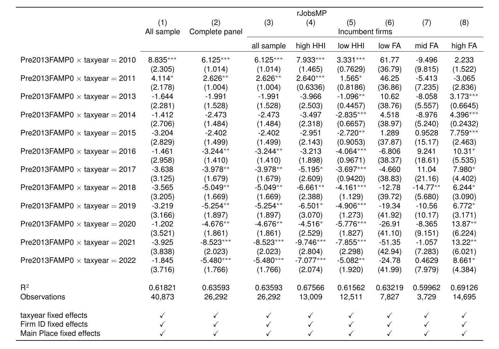
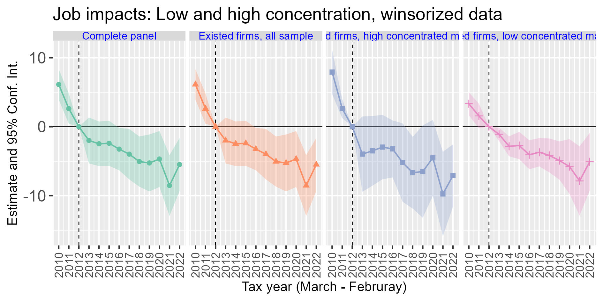
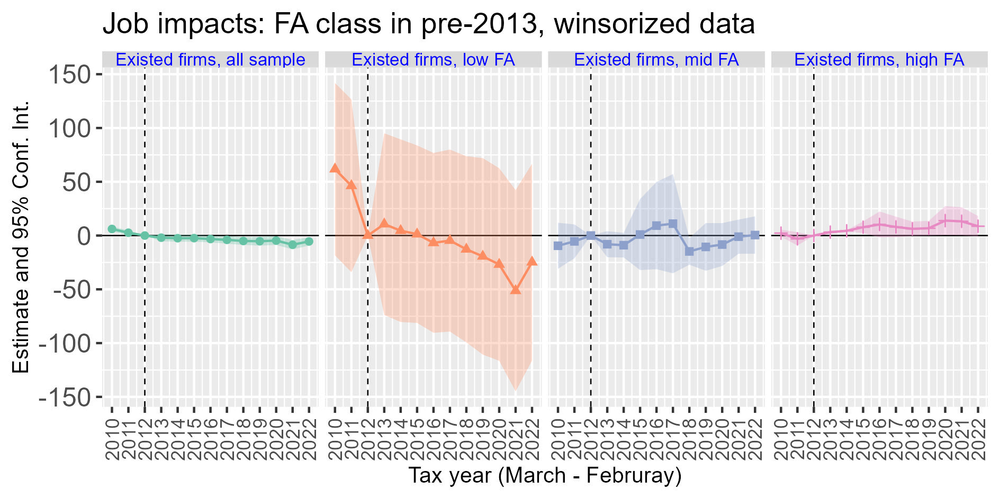
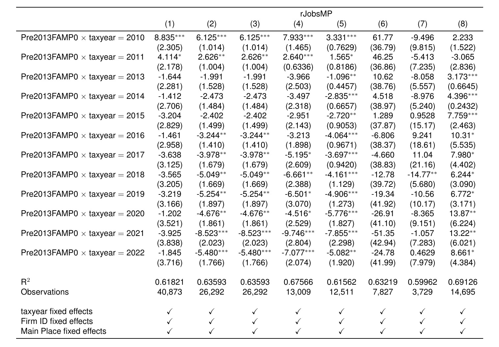

<!-- LaTeX math shortcode -->



```{r read setup from child file, child='../program/setup.Rmd', message = F, warning = F}
```
```{r read functions from child file, child='../program/destatfactor.Rmd', message = F, warning = F}
```

## Method 1: define once, tex_preview for html, cat(ltx) under results = asis for pdf

By saving the LaTeX to an R variable, you only have to write it once. 
Then you use two different code chunks to conditionally output for HTML vs PDF.

```{r define_table}
tab_string="
\\begin{tabular}{llr}
\\hline
\\multicolumn{2}{c}{Item} \\\\
\\cline{1-2}
Animal    & Description & Price (\\$) \\\\
\\hline
Gnat      & per gram    & 13.65      \\\\
          & each        & 0.01       \\\\
Gnu       & stuffed     & 92.50      \\\\
Emu       & stuffed     & 33.33      \\\\
Armadillo & frozen      & 8.99       \\\\
\\hline
\\end{tabular}"
```

```{r render_html, results="asis", warning=FALSE, message=FALSE}
#| eval: !expr knitr::is_html_output()
library(texPreview)
tex_preview(tab_string, returnType = "html")
```

```{r render_pdf, results="asis"}
#| eval: !expr knitr::is_latex_output()
# For PDF, we just dump the raw LaTeX string into the document
cat(tab_string)
```

## Method 2: Produce image file with tex_Preview for html, use raw LaTeX contents for pdf

If you prefer to write the raw LaTeX block directly into the document instead of an R string, you must wrap it in ` ```{=latex} ` so that Quarto knows to completely hide it from the HTML version.

```{r render_html_2, echo=FALSE, results="asis", warning=FALSE, message=FALSE}
#| eval: !expr knitr::is_html_output()
library(texPreview)
# (Your texPreview html code goes here)
```

```{=latex}
\begin{tabular}{llr}
\hline
\multicolumn{2}{c}{Item} \\
\cline{1-2}
Animal    & Description & Price (\$) \\
\hline
Gnat      & per gram    & 13.65      \\
          & each        & 0.01       \\
Gnu       & stuffed     & 92.50      \\
Emu       & stuffed     & 33.33      \\
Armadillo & frozen      & 8.99       \\
\hline
\end{tabular}
```
<!--  & All sample & Complete panel & \\mpage{2.5cm}{Existed firms,\\\\ all sample} & \\mpage{2.5cm}{Existed firms,\\\\ high concentrated markets} & \\mpage{2.5cm}{Existed firms,\\\\ low concentrated markets} & \\mpage{2.5cm}{Existed firms,\\\\ low FA} & \\mpage{2.5cm}{Existed firms,\\\\ mid FA} & \\mpage{2.5cm}{Existed firms,\\\\ high FA} \\\\
-->

```{r read tbl, include = F}
latex_code <- "\\begin{tabular}{lcccccccc}
   \\toprule
    & \\multicolumn{8}{c}{rJobsMP}\\\\
                                           & (1)           & (2)            & (3)            & (4)            & (5)            & (6)           & (7)           & (8)\\\\  

% &  All sample & Complete panel & \\begin{minipage}{2.5cm}Existed firms,\\\\ all sample\\end{minipage} & \\begin{minipage}{2.5cm}\\hfil Existed firms,\\\\\\hfil high HHI markets\\end{minipage} & \\begin{minipage}{2.5cm}\\hfil Existed firms,\\\\\\hfil low HHI markets\\end{minipage} & \\begin{minipage}{2.5cm}\\hfil Existed firms,\\\\\\hfil low FA\\end{minipage} & \\begin{minipage}{2.5cm}\\hfil Existed firms,\\\\hfil mid FA\\end{minipage} & \\begin{minipage}{2.5cm}\\hfil Existed firms,\\\\\\hfil high FA\\end{minipage} \\\\
&  All sample & Complete panel & \\multicolumn{6}{c}{Incumbent firms} \\\\
   \\cline{4-9} 
    & \\multicolumn{8}{c}{}\\\\[-1ex]
&   &  & all sample & high HHI & low HHI & low FA & mid FA & high FA \\\\
   \\cline{2-9} 
    & \\multicolumn{8}{c}{}\\\\[-1ex]
   Pre2013FAMP0 $\\times$ taxyear $=$ 2010  & 8.835$^{***}$ & 6.125$^{***}$  & 6.125$^{***}$  & 7.933$^{***}$  & 3.331$^{***}$  & 61.77         & -9.496        & 2.233\\\\   
                                           & (2.305)       & (1.014)        & (1.014)        & (1.465)        & (0.7629)       & (36.79)       & (9.815)       & (1.522)\\\\   
   Pre2013FAMP0 $\\times$ taxyear $=$ 2011  & 4.114$^{*}$   & 2.626$^{**}$   & 2.626$^{**}$   & 2.640$^{***}$  & 1.565$^{*}$    & 46.25         & -5.413        & -3.065\\\\   
                                           & (2.178)       & (1.004)        & (1.004)        & (0.6336)       & (0.8186)       & (36.86)       & (7.235)       & (2.836)\\\\   
   Pre2013FAMP0 $\\times$ taxyear $=$ 2013  & -1.644        & -1.991         & -1.991         & -3.966         & -1.096$^{**}$  & 10.62         & -8.058        & 3.173$^{***}$\\\\   
                                           & (2.281)       & (1.528)        & (1.528)        & (2.503)        & (0.4457)       & (38.76)       & (5.557)       & (0.6645)\\\\   
   Pre2013FAMP0 $\\times$ taxyear $=$ 2014  & -1.412        & -2.473         & -2.473         & -3.497         & -2.835$^{***}$ & 4.518         & -8.976        & 4.396$^{***}$\\\\   
                                           & (2.706)       & (1.484)        & (1.484)        & (2.318)        & (0.6657)       & (38.97)       & (5.240)       & (0.2432)\\\\   
   Pre2013FAMP0 $\\times$ taxyear $=$ 2015  & -3.204        & -2.402         & -2.402         & -2.951         & -2.720$^{**}$  & 1.289         & 0.9528        & 7.759$^{***}$\\\\   
                                           & (2.829)       & (1.499)        & (1.499)        & (2.143)        & (0.9053)       & (37.87)       & (15.17)       & (2.463)\\\\   
   Pre2013FAMP0 $\\times$ taxyear $=$ 2016  & -1.461        & -3.244$^{**}$  & -3.244$^{**}$  & -3.213         & -4.064$^{***}$ & -6.806        & 9.241         & 10.31$^{*}$\\\\   
                                           & (2.958)       & (1.410)        & (1.410)        & (1.898)        & (0.9671)       & (38.37)       & (18.61)       & (5.535)\\\\   
   Pre2013FAMP0 $\\times$ taxyear $=$ 2017  & -3.638        & -3.978$^{**}$  & -3.978$^{**}$  & -5.195$^{*}$   & -3.697$^{***}$ & -4.660        & 11.04         & 7.980$^{*}$\\\\   
                                           & (3.125)       & (1.679)        & (1.679)        & (2.609)        & (0.9420)       & (38.83)       & (21.16)       & (4.402)\\\\   
   Pre2013FAMP0 $\\times$ taxyear $=$ 2018  & -3.565        & -5.049$^{**}$  & -5.049$^{**}$  & -6.661$^{**}$  & -4.161$^{***}$ & -12.78        & -14.77$^{**}$ & 6.244$^{*}$\\\\   
                                           & (3.205)       & (1.669)        & (1.669)        & (2.388)        & (1.129)        & (39.72)       & (5.680)       & (3.090)\\\\   
   Pre2013FAMP0 $\\times$ taxyear $=$ 2019  & -3.219        & -5.254$^{**}$  & -5.254$^{**}$  & -6.501$^{*}$   & -4.906$^{***}$ & -19.34        & -10.56        & 6.772$^{*}$\\\\   
                                           & (3.166)       & (1.897)        & (1.897)        & (3.070)        & (1.273)        & (41.92)       & (10.17)       & (3.171)\\\\   
   Pre2013FAMP0 $\\times$ taxyear $=$ 2020  & -1.202        & -4.676$^{**}$  & -4.676$^{**}$  & -4.516$^{*}$   & -5.776$^{***}$ & -26.91        & -8.365        & 13.87$^{**}$\\\\   
                                           & (3.521)       & (1.861)        & (1.861)        & (2.529)        & (1.827)        & (41.10)       & (9.151)       & (6.224)\\\\   
   Pre2013FAMP0 $\\times$ taxyear $=$ 2021  & -3.925        & -8.523$^{***}$ & -8.523$^{***}$ & -9.746$^{***}$ & -7.855$^{***}$ & -51.35        & -1.057        & 13.22$^{**}$\\\\   
                                           & (3.838)       & (2.023)        & (2.023)        & (2.804)        & (2.298)        & (42.94)       & (7.283)       & (6.021)\\\\   
   Pre2013FAMP0 $\\times$ taxyear $=$ 2022  & -1.845        & -5.480$^{***}$ & -5.480$^{***}$ & -7.077$^{***}$ & -5.082$^{**}$  & -24.78        & 0.4629        & 8.661$^{*}$\\\\   
                                           & (3.716)       & (1.766)        & (1.766)        & (2.074)        & (1.920)        & (41.99)       & (7.979)       & (4.384)\\\\   
    \\\\
   R$^2$                                   & 0.61821       & 0.63593        & 0.63593        & 0.67566        & 0.61562        & 0.63219       & 0.59962       & 0.69126\\\\  
   Observations                            & 40,873        & 26,292         & 26,292         & 13,009         & 12,511         & 7,827         & 3,729         & 14,695\\\\  
   taxyear FEs                   & $\\checkmark$  & Y   & Y   & Y   & Y   & Y  & Y  & Y\\\\   
   Firm ID FEs                   & Y  & Y   & Y   & Y   & Y   & Y  & Y  & Y\\\\   
   Main Place FEs                & Y  & Y   & Y   & Y   & Y   & Y  & Y  & Y\\\\   
   \\bottomrule
\\end{tabular}"
```


```{r evaluate latex in html}
#| eval: !expr knitr::is_html_output() 
#| out.width: "800px"
#| results: "hide"
tex_preview(latex_code, 
  usrPackages = c('\\usepackage{booktabs}', '\\usepackage{amssymb}'), 
  returnType = 'html', 
  density = 300,
  fileDir = "c:/data/MinWageMarketPower/analysis/draft/", 
  ####fileDir = getwd(), 
  keep_pdf = T,
  imgFormat = "jpg",
  stem = "est201002w")
```

::::{.column-page}
::: {.content-visible when-format="html"}

:::
::::

::::{.fullwidth}
::: {.content-visible when-format="html"}



:::
::::


```{r getwd}
getwd()
```

::::{.fullwidth}
::: {.content-visible when-format="pdf"}

\hspace{-1cm}\mpage{.8\pagewidth}{

  \mpage{.8\pagewidth}{
    \hfil\textsc{\footnotesize Figure \refstepcounter{figure}\thefigure: Results: 2010-2022, establishments with baseline jobs greater than 2 by HHI \label{tab gFE201002LHw}}\\
    \includegraphics[width=.9\textwidth]{../program/figures/2026Mar17/Results2010-2022Job02LowHighw.jpg}
  }

  \mpage{.8\pagewidth}{
    \hfil\textsc{\footnotesize Figure \refstepcounter{figure}\thefigure: Results: 2010-2022, establishments with baseline jobs greater than 2 by FA \label{tab gFE201002FAclassw}}\\
    \includegraphics[width=.9\textwidth]{../program/figures/2026Mar17/Results2010-2022Job02FAclassw.jpg}
  }
}
:::
::::

\hspace{-1cm}\mpage{.8\pagewidth}{
\hfil\textsc{\footnotesize Table \refstepcounter{table}\thetable: Results: 2010-2022, establishments with baseline jobs greater than 2 \label{tab est201002w}}

  \adjustbox{max width=.8\pagewidth}{
  \begin{tabular}{lcccccccc}
     \toprule
      & \multicolumn{8}{c}{rJobsMP}\\
                                             & (1)           & (2)            & (3)            & (4)            & (5)            & (6)           & (7)           & (8)\\  
     \midrule 
     Pre2013FAMP0 $\times$ taxyear $=$ 2010  & 8.835$^{***}$ & 6.125$^{***}$  & 6.125$^{***}$  & 7.933$^{***}$  & 3.331$^{***}$  & 61.77         & -9.496        & 2.233\\   
                                             & (2.305)       & (1.014)        & (1.014)        & (1.465)        & (0.7629)       & (36.79)       & (9.815)       & (1.522)\\   
     Pre2013FAMP0 $\times$ taxyear $=$ 2011  & 4.114$^{*}$   & 2.626$^{**}$   & 2.626$^{**}$   & 2.640$^{***}$  & 1.565$^{*}$    & 46.25         & -5.413        & -3.065\\   
                                             & (2.178)       & (1.004)        & (1.004)        & (0.6336)       & (0.8186)       & (36.86)       & (7.235)       & (2.836)\\   
     Pre2013FAMP0 $\times$ taxyear $=$ 2013  & -1.644        & -1.991         & -1.991         & -3.966         & -1.096$^{**}$  & 10.62         & -8.058        & 3.173$^{***}$\\   
                                             & (2.281)       & (1.528)        & (1.528)        & (2.503)        & (0.4457)       & (38.76)       & (5.557)       & (0.6645)\\   
     Pre2013FAMP0 $\times$ taxyear $=$ 2014  & -1.412        & -2.473         & -2.473         & -3.497         & -2.835$^{***}$ & 4.518         & -8.976        & 4.396$^{***}$\\   
                                             & (2.706)       & (1.484)        & (1.484)        & (2.318)        & (0.6657)       & (38.97)       & (5.240)       & (0.2432)\\   
     Pre2013FAMP0 $\times$ taxyear $=$ 2015  & -3.204        & -2.402         & -2.402         & -2.951         & -2.720$^{**}$  & 1.289         & 0.9528        & 7.759$^{***}$\\   
                                             & (2.829)       & (1.499)        & (1.499)        & (2.143)        & (0.9053)       & (37.87)       & (15.17)       & (2.463)\\   
     Pre2013FAMP0 $\times$ taxyear $=$ 2016  & -1.461        & -3.244$^{**}$  & -3.244$^{**}$  & -3.213         & -4.064$^{***}$ & -6.806        & 9.241         & 10.31$^{*}$\\   
                                             & (2.958)       & (1.410)        & (1.410)        & (1.898)        & (0.9671)       & (38.37)       & (18.61)       & (5.535)\\   
     Pre2013FAMP0 $\times$ taxyear $=$ 2017  & -3.638        & -3.978$^{**}$  & -3.978$^{**}$  & -5.195$^{*}$   & -3.697$^{***}$ & -4.660        & 11.04         & 7.980$^{*}$\\   
                                             & (3.125)       & (1.679)        & (1.679)        & (2.609)        & (0.9420)       & (38.83)       & (21.16)       & (4.402)\\   
     Pre2013FAMP0 $\times$ taxyear $=$ 2018  & -3.565        & -5.049$^{**}$  & -5.049$^{**}$  & -6.661$^{**}$  & -4.161$^{***}$ & -12.78        & -14.77$^{**}$ & 6.244$^{*}$\\   
                                             & (3.205)       & (1.669)        & (1.669)        & (2.388)        & (1.129)        & (39.72)       & (5.680)       & (3.090)\\   
     Pre2013FAMP0 $\times$ taxyear $=$ 2019  & -3.219        & -5.254$^{**}$  & -5.254$^{**}$  & -6.501$^{*}$   & -4.906$^{***}$ & -19.34        & -10.56        & 6.772$^{*}$\\   
                                             & (3.166)       & (1.897)        & (1.897)        & (3.070)        & (1.273)        & (41.92)       & (10.17)       & (3.171)\\   
     Pre2013FAMP0 $\times$ taxyear $=$ 2020  & -1.202        & -4.676$^{**}$  & -4.676$^{**}$  & -4.516$^{*}$   & -5.776$^{***}$ & -26.91        & -8.365        & 13.87$^{**}$\\   
                                             & (3.521)       & (1.861)        & (1.861)        & (2.529)        & (1.827)        & (41.10)       & (9.151)       & (6.224)\\   
     Pre2013FAMP0 $\times$ taxyear $=$ 2021  & -3.925        & -8.523$^{***}$ & -8.523$^{***}$ & -9.746$^{***}$ & -7.855$^{***}$ & -51.35        & -1.057        & 13.22$^{**}$\\   
                                             & (3.838)       & (2.023)        & (2.023)        & (2.804)        & (2.298)        & (42.94)       & (7.283)       & (6.021)\\   
     Pre2013FAMP0 $\times$ taxyear $=$ 2022  & -1.845        & -5.480$^{***}$ & -5.480$^{***}$ & -7.077$^{***}$ & -5.082$^{**}$  & -24.78        & 0.4629        & 8.661$^{*}$\\   
                                             & (3.716)       & (1.766)        & (1.766)        & (2.074)        & (1.920)        & (41.99)       & (7.979)       & (4.384)\\   
      \\
     R$^2$                                   & 0.61821       & 0.63593        & 0.63593        & 0.67566        & 0.61562        & 0.63219       & 0.59962       & 0.69126\\  
     Observations                            & 40,873        & 26,292         & 26,292         & 13,009         & 12,511         & 7,827         & 3,729         & 14,695\\  
      \\
     taxyear fixed effects                   & $\checkmark$  & $\checkmark$   & $\checkmark$   & $\checkmark$   & $\checkmark$   & $\checkmark$  & $\checkmark$  & $\checkmark$\\   
     Firm ID fixed effects                   & $\checkmark$  & $\checkmark$   & $\checkmark$   & $\checkmark$   & $\checkmark$   & $\checkmark$  & $\checkmark$  & $\checkmark$\\   
     Main Place fixed effects                & $\checkmark$  & $\checkmark$   & $\checkmark$   & $\checkmark$   & $\checkmark$   & $\checkmark$  & $\checkmark$  & $\checkmark$\\   
     \bottomrule
  \end{tabular}
  }
}

```{r ltx}
ltx <- "\\begin{tabular}{lcccccccc}
   \\toprule
    & \\multicolumn{8}{c}{rJobsMP}\\\\
                                           & (1)           & (2)            & (3)            & (4)            & (5)            & (6)           & (7)           & (8)\\\\  
   \\midrule 
   Pre2013FAMP0 $\\times$ taxyear $=$ 2010  & 8.835$^{***}$ & 6.125$^{***}$  & 6.125$^{***}$  & 7.933$^{***}$  & 3.331$^{***}$  & 61.77         & -9.496        & 2.233\\\\   
                                           & (2.305)       & (1.014)        & (1.014)        & (1.465)        & (0.7629)       & (36.79)       & (9.815)       & (1.522)\\\\   
   Pre2013FAMP0 $\\times$ taxyear $=$ 2011  & 4.114$^{*}$   & 2.626$^{**}$   & 2.626$^{**}$   & 2.640$^{***}$  & 1.565$^{*}$    & 46.25         & -5.413        & -3.065\\\\   
                                           & (2.178)       & (1.004)        & (1.004)        & (0.6336)       & (0.8186)       & (36.86)       & (7.235)       & (2.836)\\\\   
   Pre2013FAMP0 $\\times$ taxyear $=$ 2013  & -1.644        & -1.991         & -1.991         & -3.966         & -1.096$^{**}$  & 10.62         & -8.058        & 3.173$^{***}$\\\\   
                                           & (2.281)       & (1.528)        & (1.528)        & (2.503)        & (0.4457)       & (38.76)       & (5.557)       & (0.6645)\\\\   
   Pre2013FAMP0 $\\times$ taxyear $=$ 2014  & -1.412        & -2.473         & -2.473         & -3.497         & -2.835$^{***}$ & 4.518         & -8.976        & 4.396$^{***}$\\\\   
                                           & (2.706)       & (1.484)        & (1.484)        & (2.318)        & (0.6657)       & (38.97)       & (5.240)       & (0.2432)\\\\   
   Pre2013FAMP0 $\\times$ taxyear $=$ 2015  & -3.204        & -2.402         & -2.402         & -2.951         & -2.720$^{**}$  & 1.289         & 0.9528        & 7.759$^{***}$\\\\   
                                           & (2.829)       & (1.499)        & (1.499)        & (2.143)        & (0.9053)       & (37.87)       & (15.17)       & (2.463)\\\\   
   Pre2013FAMP0 $\\times$ taxyear $=$ 2016  & -1.461        & -3.244$^{**}$  & -3.244$^{**}$  & -3.213         & -4.064$^{***}$ & -6.806        & 9.241         & 10.31$^{*}$\\\\   
                                           & (2.958)       & (1.410)        & (1.410)        & (1.898)        & (0.9671)       & (38.37)       & (18.61)       & (5.535)\\\\   
   Pre2013FAMP0 $\\times$ taxyear $=$ 2017  & -3.638        & -3.978$^{**}$  & -3.978$^{**}$  & -5.195$^{*}$   & -3.697$^{***}$ & -4.660        & 11.04         & 7.980$^{*}$\\\\   
                                           & (3.125)       & (1.679)        & (1.679)        & (2.609)        & (0.9420)       & (38.83)       & (21.16)       & (4.402)\\\\   
   Pre2013FAMP0 $\\times$ taxyear $=$ 2018  & -3.565        & -5.049$^{**}$  & -5.049$^{**}$  & -6.661$^{**}$  & -4.161$^{***}$ & -12.78        & -14.77$^{**}$ & 6.244$^{*}$\\\\   
                                           & (3.205)       & (1.669)        & (1.669)        & (2.388)        & (1.129)        & (39.72)       & (5.680)       & (3.090)\\\\\   
   Pre2013FAMP0 $\\times$ taxyear $=$ 2019  & -3.219        & -5.254$^{**}$  & -5.254$^{**}$  & -6.501$^{*}$   & -4.906$^{***}$ & -19.34        & -10.56        & 6.772$^{*}$\\\\   
                                           & (3.166)       & (1.897)        & (1.897)        & (3.070)        & (1.273)        & (41.92)       & (10.17)       & (3.171)\\\\   
   Pre2013FAMP0 $\\times$ taxyear $=$ 2020  & -1.202        & -4.676$^{**}$  & -4.676$^{**}$  & -4.516$^{*}$   & -5.776$^{***}$ & -26.91        & -8.365        & 13.87$^{**}$\\\\   
                                           & (3.521)       & (1.861)        & (1.861)        & (2.529)        & (1.827)        & (41.10)       & (9.151)       & (6.224)\\\\   
   Pre2013FAMP0 $\\times$ taxyear $=$ 2021  & -3.925        & -8.523$^{***}$ & -8.523$^{***}$ & -9.746$^{***}$ & -7.855$^{***}$ & -51.35        & -1.057        & 13.22$^{**}$\\\\   
                                           & (3.838)       & (2.023)        & (2.023)        & (2.804)        & (2.298)        & (42.94)       & (7.283)       & (6.021)\\\\   
   Pre2013FAMP0 $\\times$ taxyear $=$ 2022  & -1.845        & -5.480$^{***}$ & -5.480$^{***}$ & -7.077$^{***}$ & -5.082$^{**}$  & -24.78        & 0.4629        & 8.661$^{*}$\\\\   
                                           & (3.716)       & (1.766)        & (1.766)        & (2.074)        & (1.920)        & (41.99)       & (7.979)       & (4.384)\\\\   
    \\\\
   R$^2$                                   & 0.61821       & 0.63593        & 0.63593        & 0.67566        & 0.61562        & 0.63219       & 0.59962       & 0.69126\\\\  
   Observations                            & 40,873        & 26,292         & 26,292         & 13,009         & 12,511         & 7,827         & 3,729         & 14,695\\\\  
    \\\\
   taxyear fixed effects                   & $\\checkmark$  & $\\checkmark$   & $\\checkmark$   & $\\checkmark$   & $\\checkmark$   & $\\checkmark$  & $\\checkmark$  & $\\checkmark$\\\\   
   Firm ID fixed effects                   & $\\checkmark$  & $\\checkmark$   & $\\checkmark$   & $\\checkmark$   & $\\checkmark$   & $\\checkmark$  & $\\checkmark$  & $\\checkmark$\\\\   
   Main Place fixed effects                & $\\checkmark$  & $\\checkmark$   & $\\checkmark$   & $\\checkmark$   & $\\checkmark$   & $\\checkmark$  & $\\checkmark$  & $\\checkmark$\\\\   
   \\bottomrule
\\end{tabular}
"


```{r headerrows}
headerrows <- c("&  All sample & Complete panel & \\multicolumn{6}{c}{Incumbent firms} \\\\", "\\cline{4-9}", "& \\multicolumn{8}{c}{}\\\\[-1ex]", "&   &  & all sample & high HHI & low HHI & low FA & mid FA & high FA \\\\", "\\cline{2-9}", "& \\multicolumn{8}{c}{}\\\\[-1ex]")

```


```{r evaluate latex in html2}
#| eval: !expr knitr::is_html_output() 
#| out.width: "800px"
#| results: "hide"
library(texPreview)
tex_preview(ltx, 
  usrPackages = c('\\usepackage{booktabs}', '\\usepackage{amssymb}'), 
  returnType = 'html', 
  density = 300,
  resizebox = T,
  fileDir = "c:/data/MinWageMarketPower/analysis/draft/", 
  keep_pdf = T,
  imgFormat = "jpg",
  stem = "est201002w2")
```

::::{.column-page}
::: {.content-visible when-format="html"}

:::
::::


```{r read tbl2, echo = F, eval = F}
library(data.table)
ltx <- readLines("est201002w.tex")
ltx <- c(ltx[1:4], headerrows, ltx[-(1:5)]) # drop \midrule
#ltx <- gsub("\\$\\\\checkmark\\$", "Y", ltx)
#ltx <- gsub("toprule|midrule|bottomrule", "hline", ltx)
ltx <- gsub("\\\\", "\\", ltx, fixed = T)
```

```{r evaluate latex in html3, eval= F}
#| out.width: "800px"
#| results: "hide"
library(texPreview)
tex_preview(ltx, 
  usrPackages = c('\\usepackage{booktabs}', '\\usepackage{amssymb}'), 
  returnType = 'html', 
  density = 300,
  resizebox = F,
  fileDir = "c:/data/MinWageMarketPower/analysis/draft/", 
  keep_pdf = T,
  imgFormat = "jpg",
  stem = "est201002w_2")
```

