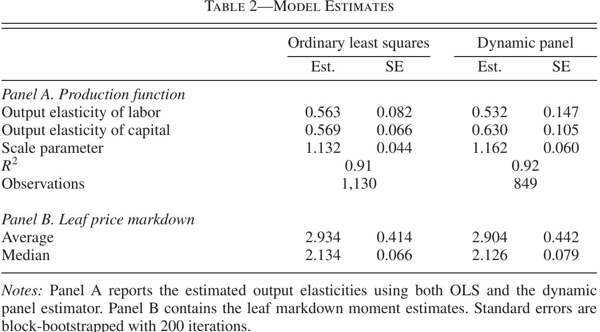
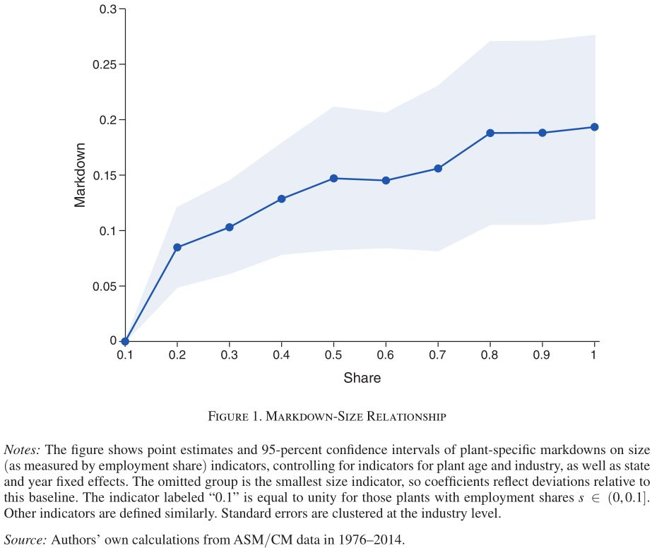
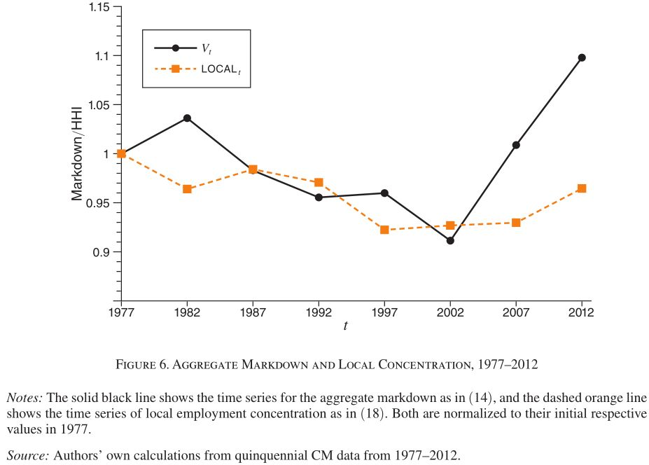
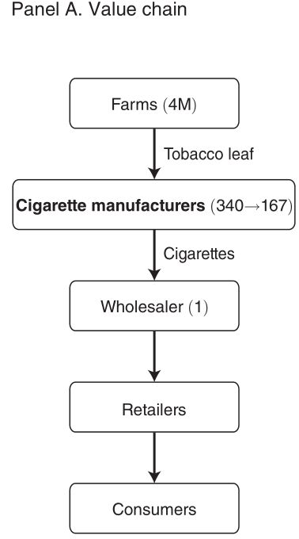
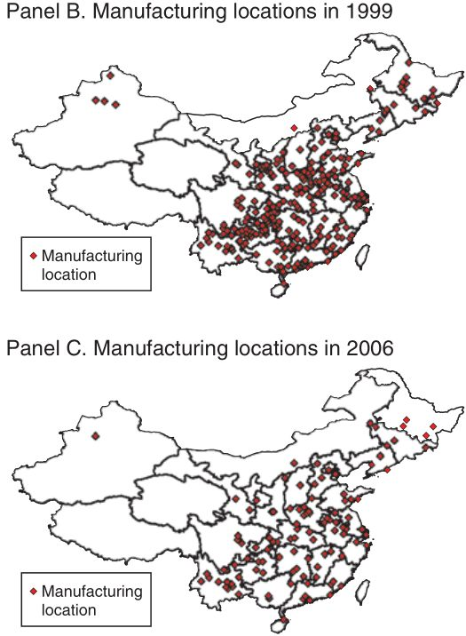
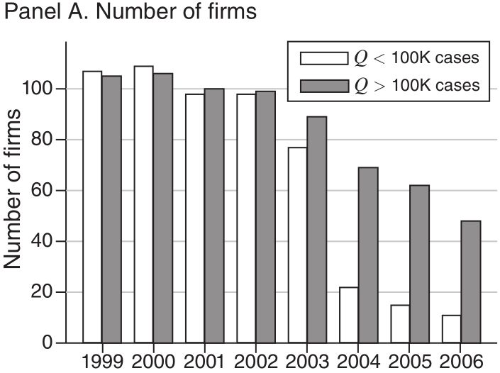
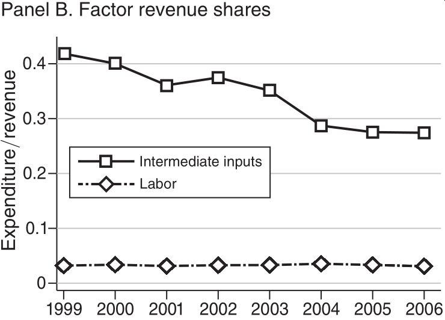
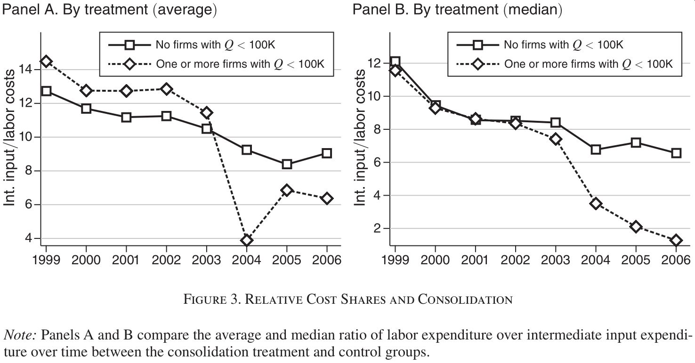
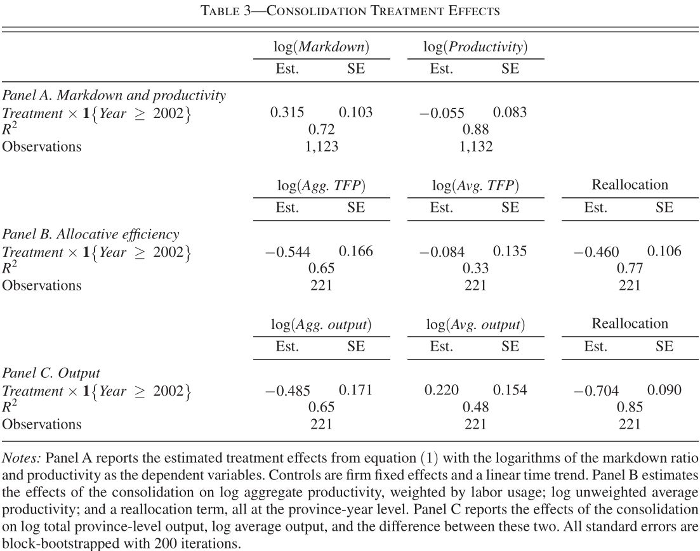

```{css, echo=FALSE}
.SeiroBenign {
  background-color: #FFEBCD;
  padding: 0.5em; /*文字まわり（上下左右）の余白*/
  /* border: 1px solid yellow; */
  /* font-weight: bold; */
	}
.SeiroLightGreen {
  background-color: #D0F0C0; /* Tea green */
  padding: 0.5em; /*文字まわり（上下左右）の余白*/
  font-family: Noto S	ans;
  /* border: 1px solid yellow; */
  /* font-weight: bold; */
}
```

```{r setup, include=FALSE} 
# include = F <==> echo=F & results = F
library(tufte)
# invalidate cache when the tufte version changes
knitr::opts_chunk$set(tidy = FALSE, cache.extra = packageVersion('tufte'), 
  margin_references = TRUE,
  # remove leading hashes in html output
  comment = "", class.source = "SeiroBenign", class.output = "SeiroLightGreen")
options(htmltools.dir.version = FALSE)
```
```{css echo=FALSE}
/* Define a margin before hX (header level X) element */
h1  {
  margin-top: 3ex;
  margin-bottom: 3ex;
  /* background: #c2edff; */ /*背景色*/
  padding: 0.5em;/*文字まわり（上下左右）の余白*/
}
h2  {
  margin-top: 2ex;
  margin-bottom: 2ex;
  padding: 0.5em;/*文字周りの余白*/
  color: #010101;/*文字色*/
  /* background: #eaf3ff; */ /*背景色*/
  /* border-bottom: solid 3px #516ab6; */ /*下線*/
}
```
\def\Perp{\mkern2mu\rotatebox[origin=c]{90}{$\models$}\mkern2mu}
\newcommand{\mpage}[2]{\begin{minipage}[t]{#1}#2\end{minipage}}
\newcommand{\cnvp}{\stackrel{p}{\longrightarrow}}
\newcommand{\cnvd}{\stackrel{d}{\longrightarrow}}
\newcommand{\bfV}{\mathbf{V}}
\newcommand{\bfX}{\mathbf{X}}
\newcommand{\bfx}{\mathbf{x}}
\newcommand{\bfa}{\mathbf{a}}
\newcommand{\bfb}{\mathbf{b}}
\newcommand{\bfp}{\mathbf{p}}
\newcommand{\bfs}{\mathbf{s}}
\newcommand{\bfz}{\mathbf{z}}
\newcommand{\E}{{\Large\varepsilon}}
\newcommand{\NU}{{\Large\nu}}
\newcommand{\0}{{\mathbf{0}}}
\newcommand{\bfalpha}{\boldsymbol{\alpha}}
\newcommand{\bfbeta}{\boldsymbol{\beta}}
\newcommand{\bftheta}{\boldsymbol{\theta}}
\newcommand{\bfeta}{\boldsymbol{\eta}}
\newcommand{\bfmu}{\boldsymbol{\mu}}
\newcommand{\bflambda}{\boldsymbol{\lambda}}
\newcommand{\ind}{\mathrel{\perp\!\!\!\!\perp}}

(労働市場力研究に関する要約)  

Seiro Ito

**Abstract**  I summarize the various proposed methods of production approach to markups/markdowns/TFP estimation. I make distrinctions between FOCs of profit maximization and FOCs of cost minimization. The original method of Hall (1998) only uses cost minimization, so do De Loecker and Warzynski (2012). Once factor price markdown is considered, one needs the marginal revenue product of an input so it takes profit maximization FOC. GNR (2020) consider output price markups yet use profit maximization FOC, which can be their limitation. 


# Summary

* Generally speaking, concentration may be a misleading measure of market power.  
* Monopolistic competition of heterogenous firms can result in a negative relationship between market power and concentration.  
* A more solid definition of market power is given by output price markups (downstream) or input price markdowns (upstream). 
* But using concentration can be OK in some markets: Studies on US/online labour markets show concentration is positively related to markdowns/supression of wages.  
* So we can start with concentration, then proceed to wage markdowns.  
* Many studies estimate markups/markdowns at the establishment level with financial statement data using the "production approach".  
* It only assumes cost minimization of firms.  
* Production approach looked very useful, but the criticism of nonidentification results by @GNR2020.  
* Literature has not come up with a method that responds to the criticism.  
* For the time being, we can start with the Rubens' or DJ's method to estimate wage markdowns. 
<!--* Caliper tests can test correlations between "statistical significance" and various editorial decisions.  -->


# Intro

Following @Hall1988's industry level estimation, @DeLoeckerWarzynski2012 developed the "production approach" to TFPR/markup estimation at the plant/firm level, by using only accounting data.  

Their algorithm follows the tradition of inverting a factor demand function to obtain (to "proxy") productivity $\omega_{jt}$ [@OlleyPakes1996; @LevinsohnPetrin2003; synthesized by @AckerbergCavesFrazer2015]. 

There are debates over ACF-DLW method:

* Invertibility of factor demand, aka scalar unobservable ass. and monotinicity ass. [@Bond2021; but see Appendix O.6.3 of @Yeh2022]  
* Nonidentification results when there is a flexible input (materials, energey) in gross output production (GNR)  
* Nonidentification results when using deflated revenues in place of physcal quantity [@Bond2021; @DeLoecker2021comment]  
* Endogeneity of inputs [or what the valid IVs are, @DoraszelskiJaumandreu2021]  
* Hicks neutral (factor non-augmenting) tech assumption [@Demirer2022; @Raval2023]


# Market power and concentration measures

Output market power $:=$ Markup, or the difference between price and marginal cost.  

Input market power $:=$ Markdown, or the difference between factor price and marginal revenue product.  

Problem: We do not observe marginal X.  

## Old method: Structure-conduct-performance literature

Herfindahl-Hirschman index (HHI, a summary measure of market shares) was used as a proxy  

Problem: Monopolistically competitive models with heterogenous firms can predict: concentration$\uparrow$ $\sim$ markup$\downarrow$  

```{r diagram2, eval = knitr::is_html_output(), echo = F}
DiagrammeR::grViz("digraph {
  graph [layout = dot, rankdir = LR]
  node [shape = rectangle, width = 1, nodesep = .75, fontsize = 10, style = filled, fillcolor = Linen]
  rec1 [label = 'concentration &uarr;']
  rec2 [label = 'markups &uarr;']
  graph [layout = dot, rankdir = BT, nodesep = 1.0]
  node [shape = ellipse, style = filled, fillcolor = lightblue]
  ell1 [label = 'productivity dispersion  &uarr;']
  edge [style = dashed]
  rec1 -> rec2 [label = 'Cournot', fontsize = 10];
  edge [color = blue]
  ell1 -> rec1
  rank=same {rec1 rec2}
  }",
  width = 500, 
  height = 250)
DiagrammeR::grViz("digraph {
  graph [layout = dot, rankdir = LR]
  node [shape = rectangle, width = 1, fontsize = 10, style = filled, fillcolor = Linen]
  rec1 [label = 'concentration &uarr;']
  rec2 [label = 'markups &darr;']
  edge [style = dashed]
  rec1 -> rec2 [label = 'monopolistically \n competitive', fontsize = 10];
  graph [layout = dot, rankdir = BT]
  node [shape = ellipse, nodesep = 1.0, style = filled, fillcolor = lightblue]
  ell1 [label = 'substitutability of goods &uarr; \n = \n price senstivity of consumers &uarr;']
  ell2 [label = 'range of products \n to compete with &uarr;']
  ell3 [label = 'firm exits &uarr;']
  # edge definitions with the node IDs
  edge [color = blue]
  ell1 -> ell2 -> ell3; ell3 -> {rec1 rec2}
  rank=same {rec1 rec2}
  }",
  width = 500,
  height = 425)
```


## Current method

Use markups (and markdowns) by obtaining marginal X in some way  

However, the old method may be valid in some markets. A positive relationship between market power and concentration:

Employment share and markdowns (Yeh, Macaluso, and Hershbein 2022) 

Employment effects of minimum wages (if small, originally large markdown) and HHI [@Azar2019]   

Job application elasticity (if small, large power) and HHI [@Azar2019AEA]  

Earnings or wages (low) and HHI [@Azar2020; @Benmelech2022]  

Income inequality and HHI [@Rinz2022]  

Slower wage growth and HHI (by hospital mergers) [@PragerSchmitt2021] 

# DLW method on markup

The point: Marginal cost can be obtained from a cost minimization problem.  

## Markup formula

Production function with a measurement error $\epsilon$ (subscripts $i, t$ are suppressed)
\[
Y=Q^{*}e^{\epsilon}, \quad
Q^{*}\leqslant F(L, K, M)e^{\omega}.
\]
Cost minimization on variable input $V=L, M$:
\[
\mathcal L=P^{V}V+rK+\lambda[Q^{*}-F(L, K, M)e^{\omega}].
\]
FOC:
\[
P^{V}-\lambda F_{V}e^{\omega}=0 \quad \lambda = \frac{P^{V}}{F_{V}e^{\omega}}.
\]
Note that $\lambda$ is a measure of marginal cost. Markup $\mu=\frac{P}{MC}$ is^[Following the notation convention of the literature, I use $S^{V}$, not $\alpha^{V}$ as in this paper, for factor revenure share of $V$. ]
\[
\begin{aligned}
\mu&=\frac{P}{\lambda}=\frac{PF_{V}e^{\omega}}{P^{V}},\\
&=\frac{PF_{V}e^{\omega}YV}{P^{V}VFe^{\epsilon+\omega}},\\
& =\frac{PY}{P^{V}V}\frac{F_{V}V}{F}e^{-\epsilon},\\
&=\frac{\theta^{V}}{S^{V}}e^{-\epsilon} ,\quad S^{V} \equiv \frac{P^{V}V}{PY}, \ \theta^{V} \equiv \frac{F_{V}V}{F}=\frac{\partial F}{\partial V}\frac{V}{F}.
\end{aligned}
\]
Once we back out $\epsilon$, we get $\mu$. With subscripts, firm specific markup $\mu_{it}=\frac{\theta^{V}_{it}}{S^{V}_{it}}e^{\epsilon_{it}}$ is affected by $\hat{\epsilon}_{it}$. Need to get rid of it. 

## Factor demand inversion

DLW suggests to invert the log factor demand $m=m(k, l, \bfp, \omega)$ to substitute with $\omega=h(k, l, m, \bfp)$,^[If, for example, $$m=a_{1}k+a_{2}l+a'_{3}\bfp+\omega,$$ then: $$\omega=\underbrace{m-(a_{1}k+a_{2}l+\bfa'_{3}\bfp)}_{\equiv h(k, l, m, \bfp)}.$$] so log production is
\[
y=f(k, l, m, \bfp)+h(k, l, m, \bfp)+\epsilon=\phi(k, l, m, \bfp)+\epsilon,
\]
where
\[
\phi(k, l, m, \bfp)=f(k, l, m, \bfp)+\omega.
\]
Then DLW suggests to regress $y$ on polynomials on $k, l, m, \bfp$ to get $\hat{\phi}$, and compute
\[
\hat{\epsilon}=y-\hat{\phi}.
\]
In inverting the factor demand, one needs:

1. Scalar unobservable assumption: There is only one latent factor $\omega$ in demand equation $m$.  
1. Monotonicity assumption: The demand function is monotonic in $\omega$.  

Monotonicity ass. is not too strong. But scalar unobservable ass. is. 

Other implicit assumptions:

3. There are no firm fixed effects $\alpha_{i}$ (or $\alpha_{i}=0$).^[But time-variant, partly random heterogenous productivity $\omega_{it}$ is incorporated. Not sure if this is a major drawback...] 
4. Output demand conditions which affect input demand differently by firms are all controlled by the observables. 

DLW acknowledges the strong imposition of 4. Covariates $\bfz_{it}$ added to control for output market conditions are:  

*  DLW: Export status, lagged inputs in $h(k, l, m, \bfp)$.^[DLW 2012 mention export status (p.2446), lagged variable inputs as IVs for current inputs (Appendix p.5), and is not explicit on what variables are used in $\bfz_{it}$.]  
* @DeLoeckeretal2016: Location dummies, output prices, product dummies, market shares, input prices, export status, input tariffs, output tariffs (p.466).  
* @DeLoecker2011: Product information and import quota protection (assumed to be exogenous to individual firms). 

Some can be endogenous to production but no discussions in DLW on IVs on firm state variables $\bfz_{it}$. 

::: {.proposition #Algo1 name="Algorithm DLW 2012"}
**Algorithm (DLW 2012)**  on $y_{it}=f(\bfx_{it}, \bfbeta)+\epsilon_{it}+\omega_{it}$ with a choice of $f$. 

1. Get $\hat{\phi}_{it}$ by regressing $y_{it}$ on polynomials in $k_{it}, l_{it}, m_{it}, \bfp'_{it}=\bfx'_{it}, \bfp'_{it}$.  
1. Impute $\hat{\omega}_{it}(\bfbeta)=\hat{\phi}_{it}-f(\bfx_{it}, \bfbeta)$ and $\hat{\omega}_{it-1}(\bfbeta)=\hat{\phi}_{it-1}-f(\bfx_{it-1}, \bfbeta)$.   
1. Assume $\omega_{it}=g(\omega_{it-1})+\xi_{it}$ where $g$ is a polynomial of choice in $\omega_{it-1}$. Get $\hat{\xi}_{it}(\bfbeta)=\hat{\omega}_{it}(\bfbeta)-g\left\{\hat{\omega}_{it-1}(\bfbeta)\right\}$.  
1. Estimate $\bfbeta$ with GMM using $\E[\hat{\xi}_{it}(\bfbeta)v_{it}]=0$ where $v_{it}$ is a flexible input chosen by firm $i$ before observing $\xi_{it}$. Use additional moment conditions (e.g., capital as a predetermined input $v_{it}=k_{it}$) to gain efficiency.  
1. Bootstrap to estimate covariance matrix: Set $B$ as number of bootstrapping. Randomly sample firms with replacement for its entire lifespan. Do 1.-4. for $B$ runs.  
:::  

Comments on DLW algorithm:  

* It takes at least 2 period panel data (vs. dynamic panel takes 3 periods). 
* Scalar unobservable (= only 1 latent factor) is crucial. 
* Materials costs: Cost of Goods and Services (COGS) in US manufacturing data. Some procured goods may be used for fixed investments or non-production purposes, so it is not a perfect measure. 
* Formula is not new and inversion is done by OP. DLW (p.2444) notes their contribution is being able to recover firm-specific estimates of markup while providing consistent estimates of output elasiticities and allowing some inputs (capital, in some cases labour) to face adjustment costs. 
* One of OP's motivation for factor demand inversion is "preserving the typically enormous cross-sectional variation for the sake of identification" [@DeLoeckerSyverson2021].  


Comparision with the dynamic panel (Blundell and Bond) estimator. 

```{r Tab2-margin, echo = F, fig.margin=TRUE, out.width = "100%"}

```

* BB estimates tend to be noisier. See Table 2 from @Rubens2023. 
* Because it double-differences out the confounds as it poses weaker assumptions on the correlation between unobservables and covariates $\E[\xi_{it}-\xi_{it-1}+(\epsilon_{it}-\rho\epsilon_{it-1})-(\epsilon_{it}-\rho\epsilon_{it-1})|k_{it-1}, l_{it-1}]=0$ (see 2.3.1 of Ackerberg 2023). This eliminates the need to invert a demand to net out $\epsilon_{it}$, or of the scalar unobservable ass. 
* Weaker statistical power leads to the use of additional moment conditions ("system GMM" estimator).^[But the economic validity of additional moment conditions can be ambiguous. ]  
* BB assumes AR(1) in $\omega_{it}$, not polynomials (as under first-order Markov).  
* BB's double-differencing eliminates the firm fixed effects $\alpha_{i}$ while DLW assumes $\alpha_{i}=0$. 


# YMH method on markdown

```{r yehfig1-margin, echo = F, fig.margin=TRUE, out.width = "100%"}

```
```{r yehfig6-margin, echo = F, fig.margin=TRUE, out.width = "100%"}

```
Yeh, Macaluso, and Hershbein (2022) showed markdown can be estimated with a formula similar to DLW.  

US all industry aggregate markdown decreased (1977-2002) but rose after 2002. Markdown is increasing in the local concentration measure (HHI).  

Profit maximization (with a single input)
\[
\max_{L}\;\;\; R(L)-w(L)L
\]
FOC
\[
R'(L)=w'(L)L+w(L)=\left(\frac{w'(L)L}{w(L)}+1\right)w(L)=\left(\varepsilon^{-1}_{s}+1\right)w(L)
\]
where $\varepsilon^{-1}_{s}$ is an inverse elasticity of input $L$ supply (or input price elasticity of input supply function). This gives the markdown $\psi^{L}$:^[How much more revenue is generated with an additional input cost. $>1$ under monopsony/oligoposny.] 
\[
\psi^{L}\equiv\frac{R'(L)}{w(L)}=\varepsilon^{-1}_{s}+1.
\]
(Variable) Cost minimization (with a single input)
\[
\mathcal L=w(L)L+\lambda[Q^{*}-F(L; \bfV, \omega)].
\]
FOC
\[
w'(L)L+w(L)=\lambda F_{L} \quad \Leftrightarrow \quad \underbrace{\frac{w'(L)L}{w(L)}+1}_{=\varepsilon^{-1}_{s}+1}=\frac{\lambda F_{L}}{w(L)}.
\]
Then
\[
\psi^{L}=\varepsilon^{-1}_{s}+1=\frac{\lambda}{P}\frac{F_{L}L}{Y}\frac{PY}{w(L)L}=\mu^{-1}\frac{\theta^{L}}{S^{L}}.
\]
Or, with any other flexible input $V=K, M$ and markup $\mu^{V}$ derived from $V$, input price markdown for $L$ is given by:^[This formula has an extra benefit that it cancels out bias terms of using deflated revenues in place of quantity. See Proposition 2 of Appendix.]
\[
\psi^{L}=\frac{\left(\frac{\theta^{L}}{S^{L}}\right)}{\left(\frac{\theta^{V}}{S^{V}}\right)}.
\]
For implementation, Yeh et al. (2022) use the DLW algorithm.  

### Data 

::: {.proposition #dataMH1 name="CM"}
**Census of Manufactures**  

Establishment level data of all manufactures in 1976-2014, collected in years ending with 2 and 7.  
Revenues and inputs (capital, labor, materials, energy) in monetary units.  

*Census Bureau*   
:::  
::: {.proposition #dataMH2 name="price"}
**NBER-CES Manufacturing Database**  

Annual industry-level data from 1958-2018 on output, employment, payroll and other input costs, investment, capital stocks, TFP, and various industry-specific price indexes.  

*National Bureau of Economic Research*   
:::  
::: {.proposition #dataMH3 name="ASM"}
**Annual Survey of Manufactures**  

Establishment level data of all manufactures in 1976-2014, rotating panel collected in every year.  
Large plants are sampled with near certainty, small plants are sampled less frequently.  

*Census Bureau*   
:::  


# Rubens' method on markup and markdown

## Nonsubstitutability of materials

Production with Leontief in (raw) materials (tobacco leaves)^[$\epsilon$ is missing, but it will not be a problem, because, in the end the paper does not invert a factor demand. But for comparability, I add it in below. To be exact with the paper, assume $\epsilon=0$. ] ^[DLW also consider Leontief in materials to which they call the "value added production function" as opposed to "gross output production function" in which they treat materials as substitutable. However, even with VA production function, they subtract the materials as if it is a preprocess of cost minimization and do not consider how materials affect FOCs.]
\[
Q^{*}\leqslant \min\left\{\beta^{M}M, H(L, K)e^{\omega}\right\}
\]
$M$ is more like a constraint that firm has to keep up with when changing other inputs... Cost minimization of planned production (free of $\epsilon$):
\[
\mathcal L=W^{M}(M)M+W^{L}(L)L+\lambda\left[Q^{*}- \min\left\{\beta^{M}M, H(L, K)e^{\omega}\right\}\right].
\]
FOC
\[
W^{M'}(M)M\frac{dM}{dL}+W^{M}(M)\frac{dM}{dL}
+W^{L'}(L)L+W^{L}(L)=\lambda H_{L}e^{\omega}.
\]
Rewriting
\[
\underbrace{\left[\frac{W^{M'}(M)}{W^{M}}M+1\right]}_{\equiv\psi^{M}}W^{M}\frac{dM}{dL}+
\underbrace{\left[\frac{W^{L'}(L)}{W^{L}}L+1\right]}_{\equiv\psi^{L}}W^{L}
=
\lambda\underbrace{H_{L}e^{\omega}}_{\frac{\partial Q^{*}}{\partial L}}
\]
$\psi^{M}$ is inverse material supply elasticity + 1 and $\psi^{L}$ is inverse labor supply elasticity + 1. So
\[
\psi^{M}W^{M}\frac{\frac{dM}{dL}}{\frac{\partial Q^{*}}{\partial L}}
+\psi^{L}W^{L}\frac{1}{\frac{\partial Q^{*}}{\partial L}}=\lambda.
\]
In Leontief, any increase in $M$ increases $Q^{*}$ at the same rate, or at $\frac{Q^{*}}{M}$:
\[
\frac{\partial Q^{*}}{\partial L}\frac{dL}{dM}=\frac{Q^{*}}{M}=\frac{Ye^{-\epsilon}}{M}.
\]
This gives
\[
\psi^{M}W^{M}\frac{1}{\frac{Ye^{-\epsilon}}{M}}
+\psi^{L}W^{L}\frac{1}{\frac{\partial Ye^{-\epsilon}}{\partial L}}=\lambda.
\]
Usual substitution gives
\[
\begin{aligned}
\lambda
&=
P\psi^{M}\frac{W^{M}M}{PYe^{-\epsilon}}+
P\psi^{L}\frac{W^{L}L}{PY}\frac{1}{\frac{\partial Ye^{-\epsilon}}{\partial L}}\frac{1}{\frac{L}{Y}},\\
&=
P\psi^{M}S^{M}e^{\epsilon}+
P\psi^{L}S^{L}\frac{1}{\theta^{L}}e^{\epsilon},
\end{aligned}
\]
or^[\eqref{4a} nests DLW (substitutable $S^{M}=0$ and input market competition $\psi^{V}=1$), Morlacco (2017, substitutable $S^{M}=0$ and input market non-competition $\psi^{V}>1$), and De Loecker and Scott (2022, nonsubstitutable $S^{M}>0$ and input market competition $\psi^{V}=1$) as special cases. ]
\begin{equation}
\mu=\left[S^{M}\psi^{M}+
S^{L}\psi^{L}\frac{1}{\theta^{L}}\right]^{-1}e^{-\epsilon}.
\tag{4a}\label{4a}
\end{equation}

Note: There is $\color{red}{\text{no input demand inversion}}$ involved up to here. 

* To be concrete, DLW's formula does not necessarily imply its implementation (algorithm with inversion). Neither does YMH's or Rubens'.  

But we need to deal with $\epsilon$.

## Identification strategy "choices"

### Design choice

Yeh et al. (2022) estimated markups and markdowns simultaneously.  

Rubens (2023) showed this is no longer possible (without further assumptions) once material is nonsubstitutable.  

* 1 equation, 6 variables  
* 3 unknowns: $\mu, \psi^{L}, \psi^{M}$  
* 3 knowns (1 estimable: $\theta^{L}$, 2 observables: $S^{L}, S^{M}$)  

Need to come up with a structure that gives values to 2 unknowns.

* $\psi^{L}=1$, $\mu_{i}=\mu=1$ and exogenously set by wholesalers, estimate $\psi^{M}$ (main text).  
  * Other values of $\mu$ in Appendix.  
* $\psi^{L}=1$, $\psi^{M}$ is given by a nested logit (over farmer occupations) framework (with many accompanying assumptions) as a function of estimated parameters of occupation share equation, estimate $\mu$ (Appendix A, C.1).  
  * Noisy estimates.  
* Others are possible.  

Why are $\psi^{L}=1$, $\mu_{i}=\mu$ plausible?  

* Wage rates did not change before and after consolidation.  
* Wholesaler (state monopoly) unilaterally sets $P$.  

Once we assume uniform exogenous markup and $\psi^{L}=1$, we have:
\begin{equation}
\begin{aligned}
\mu
&=
\frac{\beta^{L}}{S^{L}_{it}+\beta^{L}S^{M}_{it}\psi^{M}_{it}}, \\
(S^{L}_{it}+\beta^{L}S^{M}_{it}\psi^{M}_{it})\mu
&=
\beta^{L},\\
\psi^{M}_{it}
&=
\frac{\beta^{L}-\mu S^{L}_{it}}{\mu\beta^{L}S^{M}_{it}},\\
&=
\frac{1}{S^{M}_{it}}\left(\frac{1}{\mu}-\frac{S^{L}_{it}}{\beta^{L}}\right).
\end{aligned}
\tag{8}
\end{equation}

### Moment condition choice

How do we deal with $\epsilon$?  

Proxy variable approach eliminates $\epsilon$ in the moment condition by inverting a factor demand to substitute for $\omega$.  

Dynamic panel estimator leaves $\epsilon$ in the moment condition.  

Rubens chooses the latter (proxy variable approach is in Appendix), because:  

* Input demand (and its inversion) must control for (markups and) markdowns. This requires an additional structure or additional restrictions on their distributions. This limits the data from expressing heterogenous markups/markdowns. 
* With additional parametric restrictions on productivity dynamics in dynamic panel estimator, heterogenous markdowns are obtained. Since markdown estimation is the main objective, this is better suited to the purpose.^[I do not fully understand this argument.]  


## Estimation steps

Main results set $\epsilon=0$ and use dynamic panel estimator.  

Robustness check results invert a factor demand to purge $\epsilon$. 

One could have retained $\epsilon$ and estimated dynamic panel, too.  

### Estimation without $\epsilon$


1. Assume a production function with quality-unadjusted inputs $\tilde{l}, \tilde{k}$ and quality-unadjusted revenue with a quality adjustment function $a\left(p, w^{L}\right)$:
\[
q=\delta\left(\tilde{l}, \tilde{k}, \bfbeta\right)+a\left(p, w^{L}\right)+\omega
\]
1. Incorporate a consolidation dummy in productivity dynamics and assume AR(1) in redisdual productivity:
\[
\omega_{it}=\bfbeta^{z'}\bfz_{it}+\tilde{\omega}_{it}, \quad \tilde{\omega}_{it}=\rho\tilde{\omega}_{it-1}+\nu_{it}
\]
1. By $\rho$-differencing, form moment conditions $\E[\hat{\nu}_{it}(\tilde{l}_{it-1}, \tilde{k}_{it}, \tilde{k}_{it-1})]=0,$ etc. and estimate $\bfbeta$.


### Estimation with $\epsilon$

Appendix C.1. deals with $\epsilon\neq 0$. It assumes leaf as flexible but nonsubstitutable inputs and inverts its demand (termed as "control function approach").^[Control function approach, proxy variable approach, production approach...all of them seem to refer to the same thing.]  

* The "CF Approach" uses Leontief: leaf price per case = leaf costs/output in cases. Use leaf price per case $w^{M}$ in the leaf demand inversion to control for differences in input price (input quality). 
* Input demand is given by $m(p, w^{L}, w^{M}, \tilde{\bfx}, \bfbeta, \mu, \psi^{M}, \omega)$ in Appendix E^[Just derive $Q^{*}(\cdot)$ from cost minimzation FOCs and form $\frac{Q^{*}}{\beta^{M}}$ where $\beta^{M}$ is the quantity per case.] and substitute $\mu=\mu(p, \gamma^{P}, \bfs)$ with $\bfs$ is a vector of various market shares and $\gamma^{P}$ is price elasticity of output demand. $\gamma^{P}$ is assumed to be unique and to be subsumed in the intercept term (a strong ass.). $\psi^{M}$ is derived as $\psi^{M}(w^{M}, \bfs)$. Everything is sort of first-order Taylor approximation.  
\[
\begin{aligned}
q
&=
\delta\left(\tilde{\bfx}, \bfbeta\right)+a\left(p, w^{L}\right)+\omega+\epsilon,\\
&=
\delta\left(\tilde{\bfx}, \bfbeta\right)+a\left(p, w^{L}\right)+h\left(p, w^{L}, w^{M}, \tilde{\bfx}, \bfbeta, \gamma^{P}, \bfs\right)+\epsilon,\\
&=
\phi\left(\tilde{\bfx}, \bfbeta, p, w^{L}, w^{M}, \bfs\right)+\epsilon.
\end{aligned}
\]
* Productivity is backed out with the use of quality adjustment function:
\[
\omega=\hat{\phi}-\delta\left(\tilde{\bfx}, \bfbeta\right)-a\left(p, w^{L}\right).
\]
* Results do not change much (Table A4).  

> "(T)he production approach to markup measurement does not hinge
> on a particular approach to estimate the production function.
> Rather it is an approach that delivers markups (and potentially
> marginal costs) for each individual producer (and time period),
> by exploiting standard cost minimization of a variable input in production."
>
> `r tufte::quote_footer('--- De Loecker, 2020')`


# GNR criticism and the proposed solution

@GNR2020 showed DLW algorithm does not uniquely identify the production function parameters. This is a fatal blow to the "production approach". 


## Criticism: Nonidentification of elasticity

In the absence of time-series variations in relative prices $\frac{P_{t}}{P^{V}_{t}}$, IV estimation (GMM) using lagged flexible inputs as instruments for current flexible inputs does not give unique values for output elasticity $\theta^{K}, \theta^{L}$ on $k, l$.  

Even with time-series variations in relative prices, IV estimates suffer from weak identification. This is also shown in Monte Carlo by Kasahara and Sugita (2023). 


## Solution: Use price-taking profit maximization FOC to pin down material demand

But, we are trying to estimate markdowns and markups. Why a price taker?

## What shall we do?

* Some papers (e.g., Kasahara and Sugita 2023) are working on the solution.  
* A parametric solution under a Cobb-Douglas production had been proposed [@DoraszelskiJaumandreu2013].  
* We can first do concentration, then proceed to Rubens' or DJ's method, and wait to see if any nonparametric (non-functional form dependent) alternative comes up.  


# Empirical background

```{r fig1a-margin, echo = F, fig.margin=TRUE, out.width = "100%"}

```
## Farmers

* 4 million tobacco farms in China (2003), mostly small scale around .3-.4 ha (FAO 2003). 
* Planting is annual, not perennial.  
* Farmers choose which purchasing stations or intermediaries (both under particular manufacturers) within county borders to sell the leaves.  
* State Tobacco Monopoly Administration (STMA) annually sets leaf prices by quality grades, but manufacturers can flexibly change the effective prices through redefining grades and influencing local STMA management.  
* Tobacco farming got less profitable by year, but switching costs and local polical pressures for tax base prevented farmer conversions. Farmers lose cultivation rights once they move to elsewhere, so they are more tied to the location.  

## Cigarrete manufacturers

* Variable input costs consist of intermediate inputs (90%, of which 2/3 is tobacco leaves, 1/3 is paper) and labour (10%).  
* Operate as separate enterprises although formally belong to Chinese National Tobacco Corporation (CNTC).  
* Sell to a (monopsonistic) wholesaler controlled by Chinese National Tobacco Trade Corporation (CNTTC) and State STMA. 
* Wholesaler unilaterally sets cigarette factory gate prices and sells across the country.  
* Exports count 1% and imports count .2% of total industry revenue in 2019.  


```{r fig1b-margin, echo = F, fig.margin=TRUE, out.width = "100%"}

```
## Consolidation policy

May 2002, STMA ordered:

* Close down of all (98) SOEs producing less than 100K cigarette cases per year.^[3 noncomplier firms survived by 2006.]  
* Encouragement to 99 SOEs producing below 300K cases to be mergered with larger manufactures.^[51 noncomplier firms survived by 2006.]  
* Number of cigarette manufacturers: 340 (1999) $\rightarrow$ 167 (2006)  


# Data

::: {.proposition #data1 name="ASIF"}
**Annual survey of industrial firms**  

Establishment level data of all cigarette manufactures in 1999-2006, non-SOEs with sales greater than 5 million RMB and all SOEs, 470 firms with 2025 observations.  
Production and cost data in monetary units.  
Including 1132 observations of 257 firms that come with quantity information.  

*National Bureau of Statistics*   
:::  

::: {.proposition #data2 name="additional"}
**2000 Census of Population**  

County level demographic information.  

*Harvard Dataverse*  
:::  

::: {.proposition #data7 name="weather"}
**Weather data**  

County level weather  

*Chinese Meteorological Agency*   
:::  

::: {.proposition #data3 name="brand"}
**Brand information data**

Brand level cigarette characteristics  

*O'Connor et al. (2010)*  
:::  

::: {.proposition #data4 name="product"}
**Product information data**  

Product level characteristics. Quality grades, subsidy.  

*National Bureau of Statistics*   
:::  

::: {.proposition #data5 name="price"}
**FAOSTAT**  

Agricultural prices  

*FAO*   
:::  

::: {.proposition #data6 name="trade"}
**UN COMTRADE**  

Aggregate trade flows  

*UN*   
:::  

# Results

## Cost shares

```{r fig2a-margin, echo = F, fig.margin=TRUE, out.width = "100%"}

```
```{r fig2b-margin, echo = F, fig.margin=TRUE, out.width = "100%"}

```
```{r fig3, echo = F, out.width = "100%"}

```

Cost share of the leaves decreased relative to labor among the treated (below 100K cases) relative to the controls (above 100K case firms).  

## Markdowns and productivity

```{r tab3, echo = F, out.width = "100%"}

```

Markdown increased (`r round((exp(.315)-1)*100, 0)`%). 

Manufacturers reduced outputs (38%), thereby reducing leaf demand and prices.  

Manufacturers' provincial aggregate productivity^[Using number of workers as weights. Note the difference with the simple average.] decreased (`r round((1-exp(-.544))*100, 0)` \%), mostly due to leaf (mis)reallocation to low productivity manufacturers (`r round((1-exp(-.466))*100, 0)` pp), less so to individual TFP growth slowdown. 

When markdown is modeled and estimated as farmers' buyer choices (Table A1, A2), markup becomes the estimate. Estimated markup is larger which indicates cigarette price manipulations by manufacturers (with nonmarket power on the wholesaler).  

* Markup estimates are noisy.^[I think this choice could have been author's first choice if the markups and markdowns are more precisely estimated.]  

Robustness checks

* Endogenous $\psi^{M}$ with farmer choice  
* Endogenous firm exit  
* Leaf substitutablity in production  
* Labor augmeting tech  
* Cost share approach  
* Leaf market definition  
* Leaf definition changes, only large firms, different markup calibration  


```{r bib, include=FALSE}
# create a bib file for the R packages used in this document
knitr::write_bib(x = "rmarkdown", file = 'MarketPower_Tufte/MarketPower_Tufte.bib')
```

